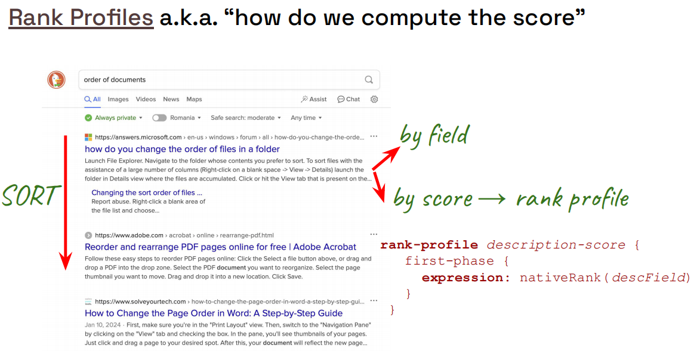
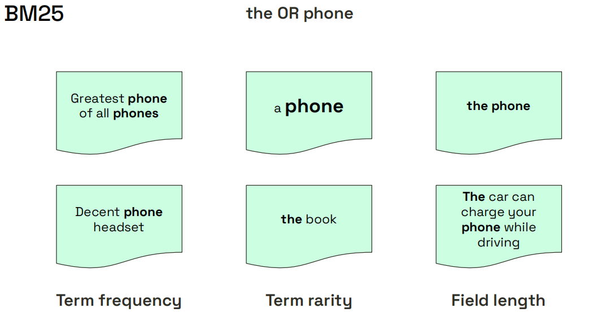
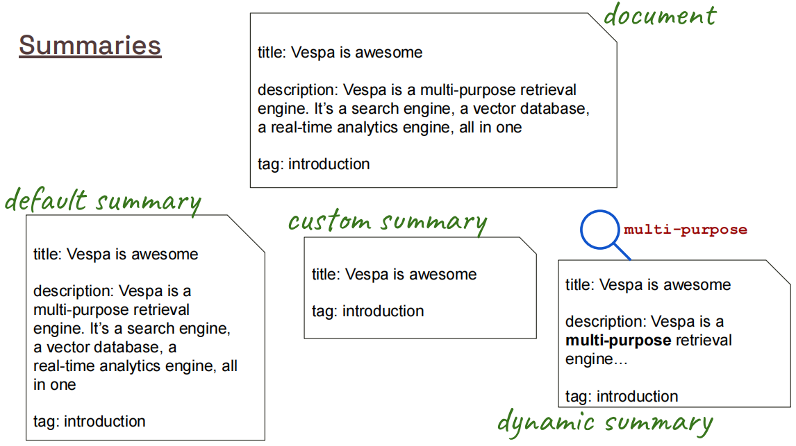

# E-commerce App – Vespa 101 Chapter 2

This project is **Chapter 2** in the Vespa 101 series.  
Chapter 1 ([`simple_ecommerce_app`](https://github.com/vespauniversity/vespaworkshop101/tree/main/simple_ecommerce_app)) introduced a tiny schema and very small dataset.  
This chapter upgrades to a **more realistic e-commerce catalog**, larger data, and runs everything on **Vespa Cloud**.

---

## Learning Objectives (Chapter 2)

After completing this chapter you should be able to:

- **Understand a richer product schema** with multiple fields (name, brand, price, etc.)
- **Understand rank profiles**
- **Learn multiple ways** to query Vespa

If any of these feel unfamiliar, quickly skim [`simple_ecommerce_app/README.md`](https://github.com/vespauniversity/vespaworkshop101/tree/main/simple_ecommerce_app) first.

---

## Project Structure

From the `ecommerce_app` root:

```text
ecommerce_app/
├── app/
│   ├── schemas/
│   │   └── product.sd              # Product document schema (edit this)
│   ├── services.xml                # Vespa services config
│   └── validation-overrides.xml    # Validation overrides (used sparingly)
├── dataset/
│   ├── myntra_products_catalog.csv # Original CSV catalog
│   ├── products.jsonl              # Converted JSONL, ready to feed
│   └── generate_jsonl.py           # Script to convert CSV → JSONL
├── img/                            # Screenshots and diagrams (optional)
├── put-get-remove.sh               # Example CRUD operations script
├── example.http                    # Example HTTP queries
├── answers.http                    # Reference/solution HTTP queries
├── dummy-document.json             # Minimal example document
└── README.md                       # This file
```


---

## Key Concepts

### What is Search?

**Search** finds relevant documents based on query terms. This chapter focuses on **text search** using keyword matching and ranking algorithms to score and sort results by relevance.

**Example**:
- Query: "blue jeans"
- **Text search** finds documents containing "blue" and "jeans" in indexed fields
- **Ranking** scores documents based on how well they match (term frequency, field importance, etc.)
- Results are sorted by relevance score (most relevant first)

### Richer Document Schema

This chapter introduces **real-world schema design** with multiple field types and indexing strategies. Unlike Chapter 1's simple schema, you'll work with a complete product catalog schema with 10+ fields (ProductName, Description, Brand, Price, etc.).

### Schema-to-Data Mapping

**Schema-to-data mapping** aligns Vespa schema fields with CSV column headers. Each schema field corresponds to a CSV column, ensuring data is correctly ingested and indexed.

### Fieldsets

**Fieldsets** group multiple fields together for efficient multi-field search. Instead of searching each field separately, `userQuery()` searches across all fields in a fieldset simultaneously. By default, userQuery() targets the default fieldset, which includes all fields in the schema marked with index. 

### Rank Profiles

**Rank profiles** define how documents are scored and sorted based on relevance. This chapter introduces two ranking algorithms:

- **`nativeRank`**: Vespa's default ranking algorithm, optimized for general text search
- **`BM25`**: Industry-standard ranking algorithm (Best Matching 25), widely used in search systems

**For detailed documentation**, see: [`RANKING`](https://docs.vespa.ai/en/basics/ranking.html)

### Data Conversion and Feeding

**Data conversion** transforms CSV to JSONL format that Vespa can ingest. **Feeding** loads data into Vespa using `vespa feed` command or Document API.

### YQL Query Language

**YQL (Vespa Query Language)** is a SQL-like language for querying Vespa. This chapter introduces basic queries, boolean logic (`and`, `or`), filtering (`Price < 5000`), and field selection.

**For detailed documentation**, see: [`YQL`](https://docs.vespa.ai/en/querying/query-language.html)

### Multiple Indexing Modes

**Indexing modes** control how fields are stored and accessed:

- **`index`**: Full-text indexed for search (enables `userQuery()` and BM25)
- **`attribute`**: In-memory data structures for fast filtering, sorting, and grouping
- **`summary`**: Returned in query results (for display)

---

## Overview

This section introduces the fundamental concepts of ranking and summaries in Vespa. If you're new to Vespa ranking, we recommend reading the detailed explanations in [`RANKING`](https://docs.vespa.ai/en/basics/ranking.html) for a deeper understanding.

### Rank Profile Overview



**What you're seeing:** This diagram illustrates how **rank profiles** work in Vespa. A rank profile defines how documents are scored and sorted based on relevance to a query. It's like a "scoring formula" that determines which documents appear first in search results.

**Key Concepts:**
- **Rank Profile**: A named configuration that defines how to calculate relevance scores for documents
- **First-Phase Ranking**: Fast, efficient ranking that runs on all matching documents retrieved during the initial query phase
- **Ranking Expression**: The formula used to calculate relevance (e.g., `nativeRank`, `bm25`)
- **Multiple Profiles**: You can define multiple rank profiles in one schema for different use cases or A/B testing

**Notes:** Think of it like this:
- **Rank Profile** = A scoring system (like a grading rubric)
- **First-Phase** = Quick initial scoring of all matches
- **Ranking Expression** = The formula that calculates the score (e.g., "how well does the title match the query?")

The product schema includes a default rank profile:

```vespa
rank-profile default {
    first-phase {
        expression: nativeRank(ProductName, Description)
    }
}
```

**What it does:**
- Scores documents based on how well `ProductName` and `Description` match the query terms
- Higher scores = more relevant documents
- Results are automatically sorted by score (highest first)

**Learn More:**
- Official Docs: [Ranking](https://docs.vespa.ai/en/ranking.html)

### BM25 Overview



**What you're seeing:** This diagram explains the **BM25** (Best Matching 25) ranking algorithm. BM25 is an industry-standard text ranking function that scores documents based on term frequency, inverse document frequency, and field length normalization.

**Key Concepts:**
- **BM25**: A probabilistic ranking function widely used in information retrieval
- **Term Frequency (TF)**: How often query terms appear in the document
- **Inverse Document Frequency (IDF)**: How rare/common the terms are across all documents
- **Field Length Normalization**: Adjusts scores based on field length (longer fields get slight penalty)

**Notes:** BM25 is like a sophisticated scoring system:
- **More term matches** = Higher score
- **Rare terms** (like "laptop") = Higher weight than common terms (like "the")
- **Field length** = Longer fields get slightly penalized to favor concise matches

**Example Usage:**

```vespa
rank-profile bm25 {
    first-phase {
        expression: bm25(ProductName) + bm25(Description)
    }
}
```

**When to Use BM25:**
- ✅ Want industry-standard text ranking
- ✅ Need proven, well-tested algorithm
- ✅ Comparing with other search systems
- ✅ Standard text search requirements

**Learn More:**
- Official Docs: [BM25](https://docs.vespa.ai/en/ranking/bm25.html)

### Native Rank Overview


**What you're seeing:** This diagram explains **nativeRank**, Vespa's default text ranking function. Unlike BM25, nativeRank considers term proximity (how close query terms are to each other) in addition to term frequency and field importance.

**Key Concepts:**
- **nativeRank**: Vespa's proprietary text ranking algorithm
- **Term Proximity**: Rewards documents where query terms appear close together
- **Field Importance**: Can weight different fields differently
- **Document Length Normalization**: Adjusts for document size

**Notes:** nativeRank is like BM25 but with extra features:
- **Term proximity** = "laptop computer" scores higher when words appear together
- **Field weighting** = Title matches can be weighted more than description matches
- **Vespa-optimized** = Built specifically for Vespa's architecture

**Example Usage:**

```vespa
rank-profile default {
    first-phase {
        expression: nativeRank(ProductName, Description)
    }
}
```

**When to Use nativeRank:**
- ✅ Need term proximity (phrases score higher)
- ✅ Want Vespa's optimized default
- ✅ Simple use cases
- ✅ Fast ranking is priority

**Learn More:**
- Official Docs: [nativeRank](https://docs.vespa.ai/en/reference/nativerank.html)

### Summaries Overview



**What you're seeing:** This diagram illustrates how **summaries** work in Vespa. Summaries control which fields are returned in query results and how they are formatted. You can have multiple summary classes for different use cases.

**Key Concepts:**
- **Summary**: Controls which fields are returned in search results
- **Default Summary**: All fields with `summary` directive are returned
- **Custom Summaries**: Named summary classes that return specific fields

**Notes:** Think of summaries like predefined views:
- **Default summary** = Automatically returns all fields marked with `summary` directive
- **Custom summary** = Predefined in schema (using `document-summary`), returns only specified fields
- **No summary** = Field not returned (even if indexed)

**Important:** Custom summaries are **defined in the schema file**, not dynamically in queries. The query just references the named summary class (e.g., `summary=compact`).

**Example Usage:**

```vespa
schema product {
    document product {
        field ProductName type string {
            indexing: summary | index
        }
        field Description type string {
            indexing: summary | index
        }
        field Price type int {
            indexing: summary | attribute
        }
    }
    
    # Default summary returns all fields with 'summary' directive
    # Custom summary for compact results
    document-summary compact {
        summary ProductName {}
        summary Price {}
    }
}
```

**Using Different Summaries:**

```bash
# 1. Default summary (all fields with 'summary' directive)
vespa query 'yql=select * from product where ProductName contains "shirt"'

# 2. Custom summary (predefined in schema - uses 'compact' summary class)
vespa query 'yql=select * from product where ProductName contains "shirt"' 'summary=compact'
```

**Dynamic Field Selection (YQL SELECT):**

You can also dynamically select specific fields using YQL `select` clause. 

```bash
# Select only ProductName and Price fields dynamically
vespa query 'yql=select ProductName, Price from product where ProductName contains "shirt"'

# Select multiple fields
vespa query 'yql=select ProductID, ProductName, ProductBrand, Price from product where ProductName contains "shirt"'

# Select with filtering
vespa query 'yql=select ProductName, Price, PrimaryColor from product where Price < 500'
```

**Key Differences:**

| Method | Definition | Flexibility | Use Case |
|--------|------------|-------------|----------|
| **Custom Summary** | Defined in schema (`document-summary`) | Fixed fields per summary class | Reusable predefined views (list view, detail view) |
| **Dynamic SELECT** | Specified in query (`select field1, field2`) | Can change per query | Ad-hoc field selection, one-off queries |

**When to Use Custom Summaries:**
- ✅ Reduce response size (return fewer fields)
- ✅ Different views for different use cases (list view vs detail view)
- ✅ Performance optimization (less data to transfer)
- ✅ Mobile vs desktop views

**Learn More:**
- Official Docs: [Document Summaries](https://docs.vespa.ai/en/document-summaries.html)
- Official Docs: [Summary Reference](https://docs.vespa.ai/en/reference/schema-reference.html#summary)

## LAB
## Step 1 – Review the Product Catalog (CSV)

Open the CSV:

- File: `dataset/myntra_products_catalog.csv`

Look at the **header row** – it defines what columns your catalog has, for example (names here are illustrative):

- `id`
- `product_title`
- `brand`
- `category`
- `price`
- `rating`
- `image_url`
- `product_url`

Your exact headers may differ, but the key idea:

> **Every column you care about in the CSV should have a corresponding field in `product.sd`.**

Convert csv to jsonl. Here is an example using a python script:
```bash
cd dataset

python generate_jsonl.py
```

---

## Step 2 – Update the Vespa Schema (`product.sd`)

Open:
- `app/schemas/product.sd`

This file defines the **product document schema**.  
Using what you learned in Chapter 1, do the following:

1. **Create fields** that match important CSV columns  
   - Example ideas (your field names should reflect your actual CSV):
     - `ProductName` – `string`, `indexing: summary | index`
     - `ProductBrand` – `string`, `indexing: summary | attribute`
     - `Gender` – `string`, `indexing: summary | attribute`
     - `Price` – `int`, `indexing: summary | attribute`
     - `NumImages` – `int`, `indexing: summary | attribute`
     - `Description` – `string`, `indexing: summary | index`
     - `PrimaryColor` – `string`, `indexing: summary | attribute`

2. **Choose indexing modes** per field  
   - **Searchable text** → `index | summary`
   - **Filter/sort fields** → `attribute` (if `attribute` is set `attribute: fast-search`, it adds B-tree or hash dictionary mapping values and allows the queries to jump directly to matching docs)
   - **Returned in results** → always include `summary`

3. **Keep it simple first**  
   - One `rank-profile default` is enough to start.
   - You can customize ranking (BM25, price/rating boosts, etc.) after data is flowing.

For detailed examples of fields and indexing, see:
- [SCHEMAS](https://docs.vespa.ai/en/schemas.html)
- [SCHEMAS_REF](https://docs.vespa.ai/en/reference/schema-reference.html)

---

## Step 3 – Deploy the Application

From the `ecommerce_app` root:

> **Assumption**: You already configured **target** and **application name** in Chapter 1  
> (for example `vespa config set target local` or `cloud`, and `vespa config set application <tenant>.<app>[.<instance>]`).

If you **skipped Chapter 1 setup**, do that first using [`simple_ecommerce_app/README.md`](https://github.com/vespauniversity/vespaworkshop101/tree/main/simple_ecommerce_app) (Prerequisites + Setup).

Then deploy this Chapter 2 app:

```bash
cd app

# set the application target
vespa config set target cloud

# set the application name something like:
vespa config set application my-tenant.ecommerce-app

# verify
vespa config get target        # Should show: cloud
vespa config get application   # Should show: tenant.app.instance

# login if needed
vespa auth login

# create the cert
vespa auth cert

# generate/copy the cert from .vespa dirs to this application if needed
# vespa auth cert add -f

vespa auth show                # Should show: Success

# deploy it
vespa deploy --wait 900

# check the status
vespa status
```

Wait for deployment to complete successfully.  
You should see output indicating the application is **ready**.

---

## Step 4 – Feed Data from JSONL

The CSV has already been converted to JSONL using:
- `dataset/generate_jsonl.py`

The resulting file:
- `dataset/products.jsonl`

Each line is a JSON document in Vespa feed format (one product per line).

> **📚 For detailed Document API and feeding examples**, see [`API_GUIDE`](https://docs.vespa.ai/en/writing/document-v1-api-guide.html).

Feed it:

```bash
vespa feed --progress 3 ../dataset/products.jsonl
```


What this does:
- Sends each JSONL line as a **put document** request to Vespa
- Uses your `product.sd` schema to validate and index fields

If feeding fails:
- Check error messages – usually it means **field names/types don’t match** your schema
- Compare:
  - Field names in `products.jsonl`
  - Field names and types in `app/schemas/product.sd`

---

## Step 5 – Verify Data with Simple Queries

Once feeding succeeds, you should verify that documents are searchable. There are **three common ways** to call YQL and the Vespa APIs in this project:

> **📚 For detailed query examples and YQL patterns**, see [YQL](https://docs.vespa.ai/en/query-language.html). For HTTP API usage, see [API_GUIDE](https://docs.vespa.ai/en/writing/document-v1-api-guide.html).

### 5.1 Using the Vespa CLI (interactive)

Run a few basic queries from the CLI (adjust field names to your schema):

```bash
# Return any products
vespa query 'yql=select * from product where true'

# Search by product title
vespa query 'yql=select * from product where ProductName contains "shirt"'

# Filter by price
vespa query 'yql=select * from product where Price < 1000'

# Combined search + filter
vespa query 'yql=select * from product where ProductName contains "sneaker" and Price < 5000'
```


These are similar in spirit to Chapter 1, but now operate on a **much richer schema and larger dataset**.

### 5.2 Using a shell script that calls the Vespa CLI

If you prefer a one-shot script to test basic CRUD, you can also use the helper shell script:

> **📚 For more Document API examples** (PUT, GET, UPDATE, DELETE), see [API_GUIDE](https://docs.vespa.ai/en/writing/document-v1-api-guide.html).

```bash
# change directory to the app root
cd ..

# run the script
sh put-get-remove.sh
```


This script will:
- **Put** a single `product` document using `dummy-document.json`
- **Get** it back by document ID
- **Query** it via YQL to verify search
- **Remove** it again and verify it is gone

You can open `put-get-remove.sh` to see the exact `vespa document` and `vespa query` commands it runs.

### 5.3 Using the HTTP REST API (example.http) or Python, java client 

You can also test queries and document APIs using the HTTP request file:

> **📚 For comprehensive HTTP API examples and patterns**, see [API_GUIDE](https://docs.vespa.ai/en/writing/document-v1-api-guide.html). You can also use Python client [Vespa Python API (pyvespa)](https://vespa-engine.github.io/pyvespa/getting-started-pyvespa.html) or Java client as a REST client (not in the scope of this workshop).

```bash
# In an HTTP client that supports .http files (e.g. VS Code REST Client)
open example.http
```

In `example.http`:
- Set `@vespa_url` at the top to your Vespa Cloud endpoint (see `vespa status`)
- Run the provided requests to:
  - **Sanity check search**: `select * from product where true`
  - **Filter by field**: `select * from product where Gender contains "men"` / `"women"`
  - **Run a grouping query**: counts by `PrimaryColor`
  - **Get a single document** via `GET {{vespa_url}}/document/v1/ecommerce/product/docid/10009781`


**Note**: Setting the tls key certificate
- Open $\text{VS}$ Code Settings ($\mathbf{Ctrl+,}$ or $\mathbf{Cmd+,}$).
- Search for rest-client.certificates.Click "Edit in settings.json" to open your raw configuration file.
- Add a configuration block for the target host that requires the certificate. 
- You must specify the exact host URL (without https://) and the absolute paths to your files. 
- Example:
```json
{
    "rest-client.certificates": {
         "e96ac6f2.c66b5c39.z.vespa-app.cloud": { // <--- 1. Match this HOSTNAME to your request URL
            "cert": "/home/user/.vespa/my-tenant.ecommerce-app.default/data-plane-public-cert.pem", // <--- 2. Path to your client certificate
            "key":  "/home/user/.vespa/my-tenant.ecommerce-app.default/data-plane-private-key.pem", // <--- 3. Path to your private key
            "passphrase": "your_key_passphrase" // <--- 4. (Optional) If your key is encrypted
        }
    }
}
```

### 5.4 Using a curl script with mTLS (direct API call)

If you prefer to call the Vespa Cloud API directly from a shell script using `curl` and client certificates, you can also use the helper script:

```sh 
sh curl-api-call.sh
```
This script will:
- Call the `/search/` endpoint on your Vespa Cloud deployment (`VESPA_URL` inside the script)
- Use your dataplane **client certificate** and **private key** (`CERT` / `KEY` variables) for mTLS
- Send a JSON body with a simple YQL query (for example, products where `Gender` contains `"women"`)

You can open `curl-api-call.sh` to see the exact `curl` command it runs and customize:
- `VESPA_URL` to match the URL from `vespa status`
- `CERT` / `KEY` paths to match your own `~/.vespa/<tenant>.<app>.<instance>/` directory


---

## Exercise – Practice YQL and Ranking

Here are a few practice tasks you can try using any of the three methods above (CLI, shell script adaptation, or `example.http`):

> **📚 Need more query examples?** See [YQL](https://docs.vespa.ai/en/query-language.html) for comprehensive YQL patterns. For ranking examples, see [Rank](https://docs.vespa.ai/en/ranking.html).

- **1. Make sure the returned shirts are blue or red**  
  - Hint: Use boolean logic on the `PrimaryColor` (or equivalent) field.  
  - Example YQL:  
    `select * from product where ProductName contains "shirt" and (PrimaryColor = "blue" or PrimaryColor = "red")`

- **2. Show shirts where price is under 500**  
  - Hint: Use a numeric comparison on the `Price` field.  
  - Example YQL:  
    `select * from product where ProductName contains "shirt" and Price < 500`

- **3. Get docs whose description contains the phrase "premium cotton"**  
  - Hint: Use `contains` on your description field.  
  - Example YQL:  
    `select * from product where Description contains "premium cotton"`

- **4. Return only the top 5 hits**  
  - Hint: Use `LIMIT 5` and/or the `hits` parameter.  
  - Example YQL:  
    `select * from product where ProductName contains "shirt" limit 5`

- **5. For each hit, return only selected fields**  
  - Hint: Change the `select *` to list fields explicitly.  
  - Example YQL:  
    `select ProductID, ProductName, Description, Price, PrimaryColor from product where true limit 5`

- **6. Change the ranking to BM25 on `ProductName` and compare results**  
  > **📚 For detailed ranking examples and BM25 configuration**, see [BM25](https://docs.vespa.ai/en/ranking/bm25.html) and [nativeRank](https://docs.vespa.ai/en/reference/nativerank.html).
  
  1. In `app/schemas/product.sd`, ensure `ProductName` is indexed text:  
     ```vespa
     field ProductName type string {
         indexing: summary | index
     }
     ```  
  2. Add a new rank profile:  
     ```vespa
     rank-profile bm25_productname inherits default {
         first-phase {
             expression: bm25(ProductName)
         }
     }
     ```  
  3. Redeploy the app so the new profile is available:  
     ```bash
     cd app
     vespa deploy --wait 900
     ```  
     (Rank-profile-only changes do **not** require re-feeding; changing `indexing` might.)  
  4. Compare `nativeRank` vs BM25 from the CLI:  
     ```bash
     # nativeRank (default)
     vespa query \
       'yql=select * from product where ProductName contains "shirt"' \
       'ranking=default'

     # BM25 on ProductName
     vespa query \
       'yql=select * from product where ProductName contains "shirt"' \
       'ranking=bm25_productname'
     ```  
     Look at the difference in hit ordering and relevance scores.  
  5. (Optional) Add a BM25 request to `example.http` using `"ranking": "bm25_productname"` to compare via HTTP.

Try implementing these in:
- `vespa query 'yql=…'`  
- `example.http` as additional requests  
- Or by adapting the queries in `answers.http`.

---

## Destroy The Deployment

**Note:** Destroy the application if needed:
   ```bash
   vespa destroy
   ```
---

## Troubleshooting Tips (Chapter 2 Focus)

- **Schema vs data mismatch**
  - Error: unknown field → Add the field to `product.sd` or remove it from feed
  - Error: wrong type → Make sure CSV/JSONL values convert cleanly to the field type
  - See [API_GUIDE](https://docs.vespa.ai/en/writing/document-v1-api-guide.html) for common Document API errors

- **No results in queries**
  - Run: `vespa query 'yql=select * from product where true'`
  - If empty: feeding failed or schema didn't match
  - See [YQL](https://docs.vespa.ai/en/query-language.html) for query troubleshooting tips

- **Ranking issues**
  - Results not relevant → Check rank profile configuration
  - See [Rank](https://docs.vespa.ai/en/ranking.html) for ranking troubleshooting

For generic Vespa deployment / CLI issues, reuse the troubleshooting section from Chapter 1.

---

## What You’ve Learned in Chapter 2

By completing this app, you have:

- Taken the **basic concepts from Chapter 1** and applied them to a **real product catalog**
- Learned how to **align a Vespa schema with an external CSV source**
- Learned basic ranking profiles
- Practiced **converting** csv to JSONL and **feeding** a larger dataset via JSONL to **Vespa Cloud**
- Learned different ways of query your data

From here, you are ready for more advanced topics:
- Adding **faceted navigation** (brands, categories)
- Implementing **better ranking** (popularity, rating, personalization)
- Moving toward **semantic / vector search** (later chapters)


## Additional Resources

- [Vespa Documentation](https://docs.vespa.ai/)
- [Schema Reference](https://docs.vespa.ai/en/schemas.html)
- [Query API Reference](https://docs.vespa.ai/en/query-api.html)
- [Document API Guide](https://docs.vespa.ai/en/document-v1-api-guide.html)
- [Vespa Cloud](https://cloud.vespa.ai/)

**Key takeaway**: This chapter builds on the basics from Chapter 1 and shows how to work with a richer, real-world product catalog, aligning a Vespa schema with CSV data, deploying to Vespa Cloud, and feeding a larger dataset.

Proceed to [Chapter 3](https://github.com/vespauniversity/vespaworkshop101/tree/main/semantic_ecommerce_app)

