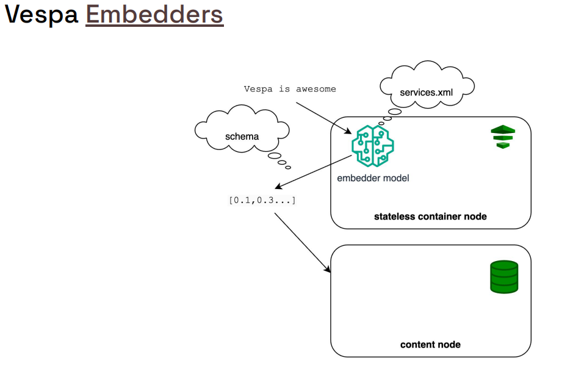
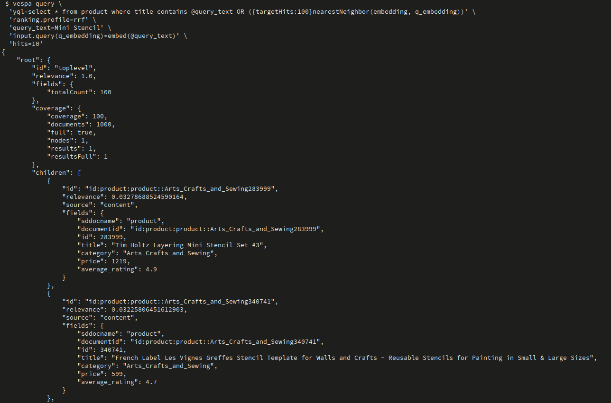

# Hybrid E-commerce App – Vespa 101 Chapter 4

This project is **Chapter 4** in the Vespa 101 series.  
Chapter 3 ([`semantic_ecommerce_app`](https://github.com/vespauniversity/vespaworkshop101/tree/main/semantic_ecommerce_app)) introduced semantic search with pre-computed embeddings.  
This chapter adds **hybrid search** combining text (BM25) and semantic (ANN) search using **Reciprocal Rank Fusion (RRF)** ranking, and introduces **query-time embedding generation** using embedder components.

The goal here is to learn how to:
- Configure **embedder components** for query-time embedding generation
- Combine **text search (BM25)** and **semantic search (ANN)** in a single query
- Use **Reciprocal Rank Fusion (RRF)** ranking to merge results from multiple retrieval methods
- Build **hybrid search queries** that leverage both lexical and semantic signals

---

## Learning Objectives (Chapter 4)

After completing this chapter you should be able to:

- **Configure embedder components** for on-the-fly embedding generation
- **Define embedding fields** that are generated from text fields during indexing
- **Build hybrid queries** that combine text and semantic search
- **Implement RRF ranking** to fuse results from multiple retrieval methods
- **Understand the trade-offs** between query-time and pre-computed embeddings
- **Optimize hybrid search** for better relevance and performance

**Prerequisites**: Complete Chapter 3 ([`semantic_ecommerce_app`](https://github.com/vespauniversity/vespaworkshop101/tree/main/semantic_ecommerce_app)) first. If you haven't, review:
- [`semantic_ecommerce_app/README.md`](https://github.com/vespauniversity/vespaworkshop101/tree/main/semantic_ecommerce_app) for semantic search and ANN basics
- [`ecommerce_app/README.md`](https://github.com/vespauniversity/vespaworkshop101/tree/main/ecommerce_app) for text search and schema fundamentals
- [`simple_ecommerce_app/README.md`](https://github.com/vespauniversity/vespaworkshop101/tree/main/simple_ecommerce_app) for fundamental concepts

---

## Project Structure

From the `hybrid_ecommerce_app` root:

```text
hybrid_ecommerce_app/
├── app/
│   ├── schemas/
│   │   └── product.sd              # Product schema with embedding field (TODO)
│   ├── services.xml                # Vespa services config (embedder TODO)
│   └── validation-overrides.xml    # Validation overrides (used sparingly)
├── dataset/
│   ├── vespa_feed-1K_no_embeddings.jsonl  # Products without embeddings
│   └── remove_embeddings.py        # Script to remove embeddings from data
├── queries.http                    # Example hybrid search queries
└── README.md                       # This file
```

You will mainly work with:
- `app/schemas/product.sd` - Schema with embedding field and RRF ranking (TODOs to complete)
- `app/services.xml` - Services config with embedder component (TODO)
- `dataset/vespa_feed-1K_no_embeddings.jsonl` - Data without pre-computed embeddings
- `queries.http` - Example queries for hybrid search

---

## Key Concepts

### What is Hybrid Search?

**Hybrid search** combines multiple retrieval methods to improve search quality:
- **Text search (BM25)**: Finds documents matching exact keywords
- **Semantic search (ANN)**: Finds documents by meaning using embeddings
- **Combined**: Leverages strengths of both approaches

**Example**:
- Query: "blue jeans"
- **BM25** finds: "blue jeans", "blue denim jeans"
- **Semantic** finds: "navy trousers", "denim pants", "indigo pants"
- **Hybrid** combines both for better coverage

### Query-Time Embedding Generation

Unlike [Chapter 3](https://github.com/vespauniversity/vespaworkshop101/tree/main/semantic_ecommerce_app) (pre-computed embeddings), this chapter uses **embedder components** to generate embeddings **on-the-fly** from query text:

- **Pre-computed** (Chapter 3): Embeddings stored in documents, faster queries
- **Query-time** (Chapter 4): Embeddings generated from query text, more flexible

**Benefits of query-time generation**:
- No need to pre-compute embeddings for all documents
- Can generate embeddings from any query text
- Easier to update embedding models
- Supports dynamic queries

### Reciprocal Rank Fusion (RRF)

**RRF** is a ranking technique that combines results from multiple retrieval methods:

```
RRF Score = Σ (1 / (k + rank_i))
```

Where:
- `k` = a numerical constant (default 60.0)
- `rank_i` = rank of document in result set `i`

**For detailed information** about RRF, see:
- **Vespa Documentation**: [Phased Ranking - reciprocal_rank()](https://docs.vespa.ai/en/phased-ranking.html) - Covers the `reciprocal_rank()` function implementation
- **Academic Paper**: [Reciprocal Rank Fusion (RRF)](https://plg.uwaterloo.ca/~gvcormac/cormacksigir09-rrf.pdf) - Original paper by Cormack et al. (2009) describing the RRF algorithm

**How it works**:
1. Run text search → get ranked results
2. Run semantic search → get ranked results
3. Combine using RRF → final ranked results

**Benefits**:
- Combines strengths of both methods
- Handles different result sets gracefully
- No need to normalize scores
- Works well when methods disagree

### Embedder Components

Vespa supports embedder components that generate embeddings from text:
- **HuggingFace embedder**: Uses HuggingFace models (e.g., sentence-transformers)
- **ONNX embedder**: Uses ONNX models
- **Custom embedders**: Build your own

**Configuration** (in `services.xml`):
```xml
<component id="e5" type="hugging-face-embedder">
  <transformer-model model-id="e5-small-v2"/>
</component>
```

**Usage** (in schema):
```javascript
field embedding type tensor<float>(x[384]) {
  indexing {
    (input title || "") . " " . (input description || "") | embed e5 | attribute | index
  }
}
```

**For detailed documentation**, see: https://docs.vespa.ai/en/embedding.html

---

## Overview

This section introduces the fundamental concepts of embedders, embeddings, hybrid search with Reciprocal Rank Fusion (RRF), and phased ranking in Vespa. 

### Embedders Overview



**What you're seeing:** This diagram illustrates what **embedder components** are in Vespa. Embedders are services that convert text into dense vector representations (embeddings) using machine learning models. They can be configured in `services.xml` and used during both document indexing and query processing.

**Key Concepts:**
- **Embedder Component**: A service configured in `services.xml` that generates embeddings from text
- **HuggingFace Embedder**: Most commonly used embedder type, supporting models from HuggingFace Hub
- **Model Hub**: Pre-configured models available in Vespa Cloud (e.g., `e5-small-v2`, `e5-base-v2`)
- **Index-time Embedding**: Embeddings generated during document indexing and stored in the index
- **Query-time Embedding**: Embeddings generated on-the-fly from query text using the `embed()` function

**Example Embedder Configuration (`services.xml`):**
```xml
<component id="e5" type="hugging-face-embedder">
  <transformer-model model-id="e5-small-v2"/>
</component>
```

This configures an embedder named `e5` using the E5-small-v2 model from Vespa Model Hub, which generates 384-dimensional embeddings.

**Learn More:**
- Official Docs: [Embedding](https://docs.vespa.ai/en/embedding.html)
- Model Hub: [Vespa Cloud Model Hub](https://cloud.vespa.ai/en/model-hub)

### Embedding Overview


**What you're seeing:** This diagram illustrates how **embeddings** are generated and used in Vespa. Embeddings are dense vector representations of text that capture semantic meaning, enabling semantic search through approximate nearest neighbor (ANN) search.

**Key Concepts:**
- **Embedding Field**: A tensor field that stores vector embeddings (e.g., `tensor<float>(x[384])`)
- **Indexing Pipeline**: An example indexing pipeline may embed text and store embeddings in a tensor field
- **HNSW Index**: Hierarchical Navigable Small World graph index for efficient ANN search
- **Distance Metric**: How similarity is measured (e.g., `angular`, `euclidean`, `innerproduct`)
- **Query-time Embedding**: Using `embed()` function to generate embeddings from query text

**Example Embedding Field Definition:**
```vespa
field embedding type tensor<float>(x[384]) {
  indexing {
    (input title || "") . " " . (input description || "") | embed e5 | attribute | index
  }
  attribute {
    distance-metric: angular
  }
  index {
    hnsw {
      max-links-per-node: 16
      neighbors-to-explore-at-insert: 200
    }
  }
}
```

This field generates embeddings by concatenating title and description, then using the `e5` embedder component. The embedding is stored as an attribute with angular distance metric and indexed with HNSW for fast ANN search.

**Learn More:**
- Official Docs: [Embedding](https://docs.vespa.ai/en/embedding.html)
- Official Docs: [Nearest Neighbor Search](https://docs.vespa.ai/en/nearest-neighbor-search.html)

### Hybrid Search with Reciprocal Rank Fusion (RRF) Overview


**What you're seeing:** This diagram illustrates how **hybrid search with Reciprocal Rank Fusion (RRF)** combines multiple retrieval methods to improve search quality. RRF merges results from text search (BM25) and semantic search (ANN) by converting ranks to reciprocal ranks and summing them.

**Key Concepts:**
- **Hybrid Search**: Combining multiple retrieval methods (text + semantic) in a single query
- **Reciprocal Rank Fusion (RRF)**: A ranking technique that combines ranked lists by converting ranks to reciprocal ranks. It focuses on rank position rather than absolute scores
- **Reciprocal Rank**: `1.0 / (k + rank)` - converts rank position to a score (lower rank = higher score). A document at rank 1 gets score 1/(60+1) = 0.0164, rank 2 gets 1/(60+2) = 0.0161
- **Global-Phase Ranking**: Final reranking step that operates on the merged hits from all **content nodes** and combines signals from multiple methods
- **Rank Normalization**: RRF automatically handles different score scales from different methods

**Example RRF Rank Profile:**
```vespa
rank-profile rrf inherits use_closeness {
  function best_bm25() {
    expression: max(bm25(title), bm25(description))
  }
  global-phase {
    rerank-count: 200
    expression: reciprocal_rank(closeness(field, embedding)) + reciprocal_rank(best_bm25())
  }
}
```

This rank profile combines semantic search (closeness) with text search (BM25) using RRF. The global-phase reranks the top 200 results by summing reciprocal ranks from both methods.

**What it does:**
- Documents that rank well in both BM25 and semantic search get higher final scores
- Automatically normalizes different score scales from different methods
- Focuses on rank position rather than absolute scores, making it robust to score variations

**Learn More:**
- Official Docs: [Phased Ranking](https://docs.vespa.ai/en/phased-ranking.html)
- Academic Paper: [Reciprocal Rank Fusion](https://plg.uwaterloo.ca/~gvcormac/cormacksigir09-rrf.pdf)

### Phased Ranking Overview


**What you're seeing:** This diagram illustrates how **phased ranking** works in Vespa. Phased ranking optimizes search performance by using multiple ranking phases with different computational costs - fast ranking on all documents, then expensive ranking on top candidates.

**Key Concepts:**
- **First-Phase Ranking**: Fast ranking that runs on all matching documents (must be efficient)
- **Second-Phase Ranking**: More expensive ranking on top-K candidates from first phase
- **Global-Phase Ranking**: Final ranking across all content nodes after merging results
- **Rerank-Count**: Number of top candidates to rerank in second/global phase (e.g., 100, 200)
- **Performance Optimization**: Use fast functions in first phase, expensive functions in later phases

**Notes:** Think of it like this:
- **First-Phase** = Quick initial scoring of all matches (like a first-round interview)
- **Second-Phase** = Detailed evaluation of top candidates (like a final interview)
- **Global-Phase** = Final ranking after merging results from all nodes (like a final decision)
- **Rerank-Count** = How many candidates to evaluate in detail (balance between quality and speed)

**Example Two-Phase Ranking:**
```vespa
rank-profile two_phase {
  first-phase {
    expression: bm25(title) + bm25(description)
  }
  second-phase {
    rerank-count: 100
    expression: lightgbm("model.json")
  }
}
```

This rank profile uses fast BM25 in the first phase to score all matching documents, then uses an expensive LightGBM model on the top 100 candidates in the second phase.

**What it does:**
- First phase quickly filters down to top candidates using fast functions (BM25, nativeRank, closeness)
- Second phase applies expensive ranking (ML models, complex computations) only on top candidates
- Global phase handles cross-hit normalization and combining signals from multiple sources
- Optimizes for both quality and performance by limiting expensive operations

**Learn More:**
- Official Docs: [Phased Ranking](https://docs.vespa.ai/en/phased-ranking.html)
- Official Docs: [Ranking Expressions](https://docs.vespa.ai/en/ranking/ranking-expressions.html)

## Lab
## Step 1 – Review the Schema

Open:
- `app/schemas/product.sd`

These schemas extend Chapter 3's schema but has **TODOs** for you to complete:

### Current State

The schema has:
- Text fields (`title`, `description`) with BM25 indexing
- Attribute fields (`category`, `price`, `average_rating`)
- A `use_closeness` rank profile for semantic search
- **TODO**: Define the embedding field (generated from text fields)
- **TODO**: Define the RRF rank profile for hybrid search

### TODO 1: Define Embedding Field

You need to add an embedding field that is **generated from text fields** during indexing:

```javascript
field embedding type tensor<float>(x[384]) {
  indexing {
    (input title || "") . " " . (input description || "") | embed e5 | attribute | index
  }
  attribute {
    distance-metric: angular
  }
  index {
    hnsw {
      max-links-per-node: 16
      neighbors-to-explore-at-insert: 200
    }
  }
}
```

**Key points**:
- `embed e5` - Uses the embedder component named "e5" (defined in `services.xml`)
- `input title` and `input description` - Generates embedding from both the `title` and `description` fields
- `. " " .` - Concatenates the fields with a space separator
- `|| ""` - Fallback to empty string if title or description is missing
- `attribute | index` - Stores as attribute and indexes with HNSW

### TODO 2: Define RRF Rank Profile

You need to implement the RRF rank profile:

```javascript
rank-profile rrf inherits use_closeness {
  function best_bm25() {
    expression: max(bm25(title), bm25(description))
  }
  global-phase {
    rerank-count: 200
    expression: reciprocal_rank(closeness(field, embedding)) + reciprocal_rank(best_bm25())
  }
}
```

**Key points**:
- `inherits use_closeness` - Reuses the closeness function
- `best_bm25()` - Gets the best BM25 score from title or description
- `global-phase` - Reranks top 200 results
- `reciprocal_rank()` - Converts scores to reciprocal ranks for RRF

### About `reciprocal_rank()` Function

The `reciprocal_rank()` function is a **built-in Vespa function** that implements Reciprocal Rank Fusion (RRF) normalization. It's specifically designed for combining results from multiple ranking methods.

**How it works**:
1. **Ranks documents** by the input expression (e.g., `closeness()` or `best_bm25()`)
   - Highest score → rank 1
   - Second highest → rank 2
   - And so on...
2. **Converts rank to reciprocal rank** using the formula: `1.0 / (k + rank)`
   - Where `k` is a constant (default: 60.0)
   - Lower rank number = higher reciprocal rank value
3. **Returns the reciprocal rank** value for each document

**Formula**:
```
reciprocal_rank(expression, k)
output = 1.0 / (k + rank)
```

**Example**:
- Document A: rank 1 in BM25, rank 3 in ANN
- Document B: rank 2 in BM25, rank 1 in ANN
- With k=60:
  - A: `1/(60+1) + 1/(60+3) = 0.0164 + 0.0159 = 0.0323`
  - B: `1/(60+2) + 1/(60+1) = 0.0161 + 0.0164 = 0.0325`
- B wins (higher combined RRF score)

**Why use `reciprocal_rank()`?**
- **Normalizes different score scales** - BM25 and closeness scores are on different scales
- **Focuses on rank order** - Emphasizes position rather than absolute score values
- **Handles rank positions correctly** - Uses actual rank positions, not score approximations
- **Built-in optimization** - Efficiently implemented by Vespa

**Parameters**:
- First argument: The ranking expression to normalize (e.g., `closeness(field, embedding)`, `best_bm25()`)
- Second argument (optional): The `k` constant (default: 60.0)
  - Lower k = rank matters more (more emphasis on top results)
  - Higher k = rank matters less (more uniform distribution)

**Documentation**: For detailed information, see the [Vespa Phased Ranking documentation](https://docs.vespa.ai/en/phased-ranking.html) which covers `reciprocal_rank()` and other global-phase ranking functions.

**For detailed schema configuration**, see the schema file comments and Vespa documentation.

---

## Step 2 – Configure the Embedder Component

Open:
- `app/services.xml`

You need to add an embedder component configuration.

### TODO: Add HuggingFace Embedder

Add the embedder component inside the `<container>` section:

```xml
<component id="e5" type="hugging-face-embedder">
  <transformer-model model-id="e5-small-v2"/>
</component>
```

**Key points**:
- `id="e5"` - Component name (referenced in schema as `embed e5`)
- `type="hugging-face-embedder"` - Uses HuggingFace embedder
- `model-id` - HuggingFace model identifier (384 dimensions for e5-small-v2)

**Alternative models**:
- `e5-small-v2` - 384 dimensions
- `e5-base-v2` - 768 dimensions
- `e5-large-v2` - 1024 dimensions
- `minilm-l6-v2` - 384 dimensions

**For detailed embedder configuration**, see: https://docs.vespa.ai/en/embedding.html#huggingface-embedder

---

## Step 3 – Deploy the Application

From the `hybrid_ecommerce_app` root:

> **Assumption**: You already configured **target** and **application name** in previous chapters  
> (for example `vespa config set target cloud`, and `vespa config set application <tenant>.<app>[.<instance>]`).

If you **skipped previous chapters**, do that first using [`ecommerce_app/README.md`](https://github.com/vespauniversity/vespaworkshop101/tree/main/ecommerce_app) (Prerequisites + Setup).

Then deploy this Chapter 4 app:

```bash
cd app

# Verify your application configuration
vespa config get target        # Should show: cloud

# Set the application target if it is not cloud
# $ vespa config set target cloud

vespa config get application   # Should show: tenant.app.instance

# Set the application name if it is not already set
# $ vespa config set application my-tenant.ecommerce-app

# Login if needed
vespa auth login

# Create certificates if needed
vespa auth cert

# generate/copy the cert from .vespa dirs to this application if needed
# vespa auth cert add -f

# Deploy the application
vespa deploy --wait 900

# Check the status
vespa status
```

Wait for deployment to complete successfully.  
You should see output indicating the application is **ready**.

**Note**: The embedder component will download the model on first use, which may take a few minutes.

---

## Step 4 – Delete Existing Documents (If Any)

> **Important**: If you have existing documents from previous chapters, delete them first to avoid conflicts or setup the new application.

### Option 1: Using Vespa Cloud Console

1. Go to your application in [Vespa Cloud](https://console.vespa.ai/)
2. Navigate to the **Metrics** section
3. Find the **Documents** count
4. Click **"(delete)"** to remove all documents

**Note**: Deleting documents may take a while. Give it half a minute to complete before feeding data in the next step.

### Option 2: Using Document API

You can also use the Document v1 API to delete documents programmatically:

```bash
# Delete all documents (example - adjust document IDs to match your data)
vespa document remove id:ecommerce:product::1
vespa document remove id:ecommerce:product::2
```

### Option 3: Query and Delete

```bash
# First, query to see what documents exist
vespa query 'yql=select * from product where true'

# Then delete specific documents by ID
vespa document remove <document-id>
```

### Option 4: Bulk Delete Script

```bash
# Using a loop to delete all document IDs
# This script queries all documents, extracts their IDs, and deletes them using jq
vespa query 'yql=select * from product where true' 'hits=400' | \
  jq -r '.root.children[].id' | \
  while read doc_id; do
    echo "Deleting document: $doc_id"
    vespa document remove "$doc_id"
  done
```

**Note**: 
- Adjust `hits=400` if you have more documents (or remove limit to get all)
- The script processes documents in batches - if you have many documents, you may need to run it multiple times
- For very large datasets, consider using the Vespa Cloud Console delete option instead

---

## Step 5 – Feed the Sample Data

The dataset contains products **without pre-computed embeddings**. Embeddings will be generated **during indexing** using the embedder component.

**File**: `dataset/vespa_feed-1K_no_embeddings.jsonl`

Each line is a JSON document with text fields (`title`, `description`) but **no embedding field**.

### Feed the Data

```bash
# From the hybrid_ecommerce_app root directory
vespa feed --progress 3 ../dataset/vespa_feed-1K_no_embeddings.jsonl
```

**What this does**:
- Sends each JSONL line as a **put document** request to Vespa
- The `embedding` field is **generated automatically** from the `title` and `description` fields using the embedder
- The embedding is indexed using **HNSW** for fast ANN search
- Documents are validated against the schema

**Note**: 
- Embedding generation happens **during indexing**, not at query time
- The embedder component processes each document's text fields
- This is different from [Chapter 3](https://github.com/vespauniversity/vespaworkshop101/tree/main/semantic_ecommerce_app) where embeddings were pre-computed

### Verify Data Was Fed

Check that documents were successfully indexed with embeddings:

```bash
vespa query 'yql=select * from product where true' 'hits=5'
```

You should see products with their embeddings generated and indexed.

**If feeding fails**:
- Check error messages – usually means **embedder not configured** or **field names/types don't match** your schema
- Verify embedder component is defined in `services.xml`
- Verify embedding field is defined in `app/schemas/product.sd`
- Check that text fields (`title`, `description`) exist in the JSONL data

---

## Step 6 – Run Hybrid Search Queries

Now that data is fed, you can perform **hybrid search** queries that combine text and semantic search.

### Option 1: Using Vespa CLI

**Text-only search (BM25)**:

```bash
vespa query \
  'yql=select * from product where title contains "stencil"' \
  'ranking.profile=default' \
  'hits=10'
```

**Semantic-only search (ANN)**:

```bash
vespa query \
  'yql=select * from product where {targetHits:100}nearestNeighbor(embedding, q_embedding)' \
  'ranking.profile=use_closeness' \
  'query_text=Mini Stencil' \
  'input.query(q_embedding)=embed(@query_text)' \
  'hits=10'
```

**Note**: `embed(@query_text)` uses the embedder component to generate the query embedding on-the-fly from the text parameter. This works in Vespa CLI but **not in REST API JSON queries** (see Option 2 below for REST API limitations).

**Hybrid search (BM25 + ANN with RRF)**:

```bash
vespa query \
  'yql=select * from product where title contains @query_text OR ({targetHits:100}nearestNeighbor(embedding, q_embedding))' \
  'ranking.profile=rrf' \
  'query_text=Mini Stencil' \
  'input.query(q_embedding)=embed(@query_text)' \
  'hits=10'
```

**Note**: The `embed()` function generates embeddings at query time using the embedder component configured in `services.xml`. Both text search (BM25) and semantic search (ANN) are combined using RRF ranking.



### Option 2: Using Query REST Client

Fill in the template in the file `queries.http` using a code editor (e.g., VS Code with REST Client plugin) and run the queries.

**The Example File**: `queries.http`

1. **Verify data was fed**:
   ```json
   {
     "yql": "select * from product where true",
     "presentation.summary": "medium"
   }
   ```

2. **ANN search with query-time embedding**:
   ```json
   {
     "yql": "select * from product where {targetHits:100}nearestNeighbor(embedding, q_embedding)",
     "ranking.profile": "use_closeness",
     "presentation.summary": "medium",
     "query_text": "Mini Stencil",
     "input.query(q_embedding)": "embed(@query_text)"
   }
   ```

3. **Hybrid search with RRF**:
   ```json
   {
     "yql": "select * from product where title contains @query_text OR ({targetHits:100}nearestNeighbor(embedding, q_embedding))",
     "ranking.profile": "rrf",
     "presentation.summary": "medium",
     "query_text": "Mini Stencil",
     "input.query(q_embedding)": "embed(@query_text)"
   }
   ```


  

### Understanding the Queries

**Components**:
- `title contains @query_text` - Text search using BM25
- `{targetHits:100}nearestNeighbor(embedding, q_embedding)` - Semantic search using ANN
- `OR` - Combines both retrieval methods
- `embed(@query_text)` - Generates query embedding on-the-fly from text
- `ranking.profile=rrf` - Uses RRF ranking to combine results

**Query-time embedding**:
- `embed("text")` - Calls the embedder component to generate a vector
- Works with any text string
- No need to pre-compute query embeddings

**For detailed query syntax**, see: https://docs.vespa.ai/en/querying/nearest-neighbor-search-guide.html

---

## Step 7 – Experiment with Different Queries

### 7.1 Text-Only Search

Find products using keyword matching:

```bash
vespa query \
  'yql=select * from product where title contains "shirt"' \
  'ranking.profile=default' \
  'hits=10'
```

### 7.2 Semantic-Only Search

Find products using semantic similarity:

```bash
vespa query \
  'yql=select * from product where {targetHits:100}nearestNeighbor(embedding, q_embedding)' \
  'ranking.profile=use_closeness' \
  'input.query(q_embedding)=embed("comfortable shirt")' \
  'hits=10'
```

### 7.3 Hybrid Search with RRF

Combine both methods:

```bash
vespa query \
  'yql=select * from product where title contains @query_text OR ({targetHits:100}nearestNeighbor(embedding, q_embedding))' \
  'ranking.profile=rrf' \
  'query_text=comfortable shirt' \
  'input.query(q_embedding)=embed(@query_text)' \
  'hits=10'
```

### 7.4 Hybrid Search with Filters

Add attribute filters:

```bash
vespa query \
  'yql=select * from product where (title contains @query_text OR ({targetHits:100}nearestNeighbor(embedding, q_embedding))) and price < 1000 and category = "electronics"' \
  'ranking.profile=rrf' \
  'query_text=smartphone' \
  'input.query(q_embedding)=embed(@query_text)' \
  'hits=10'
```

### 7.5 Compare Ranking Profiles

Run the same query with different ranking profiles:

```bash
# Text only
vespa query \
  'yql=select * from product where title contains "shirt"' \
  'ranking.profile=default'

# Semantic only
vespa query \
  'yql=select * from product where {targetHits:100}nearestNeighbor(embedding, q_embedding)' \
  'ranking.profile=use_closeness' \
  'input.query(q_embedding)=embed("shirt")'

# Hybrid with RRF
vespa query \
  'yql=select * from product where title contains @query_text OR ({targetHits:100}nearestNeighbor(embedding, q_embedding))' \
  'ranking.profile=rrf' \
  'query_text=shirt' \
  'input.query(q_embedding)=embed(@query_text)'
```

Compare the results and relevance scores.

---

## Exercise – Complete the TODOs

Here are the tasks you need to complete:

### 1. Define the Embedding Field

In `app/schemas/product.sd`, add the embedding field that generates embeddings from the `title` and `description` fields:

```javascript
field embedding type tensor<float>(x[384]) {
  indexing {
    (input title || "") . " " . (input description || "") | embed e5 | attribute | index
  }
  attribute {
    distance-metric: angular
  }
  index {
    hnsw {
      max-links-per-node: 16
      neighbors-to-explore-at-insert: 200
    }
  }
}
```

**Place it** after the document fields but before the `fieldset` definition.

### 2. Configure the Embedder Component

In `app/services.xml`, add the HuggingFace embedder component:

```xml
<component id="e5" type="hugging-face-embedder">
  <transformer-model model-id="e5-small-v2"/>
</component>
```

**Place it** inside the `<container>` section, before `<document-api/>`.

### 3. Implement the RRF Rank Profile

In `app/schemas/product.sd`, uncomment and complete the RRF rank profile:

```javascript
rank-profile rrf inherits use_closeness {
  function best_bm25() {
    expression: max(bm25(title), bm25(description))
  }
  global-phase {
    rerank-count: 200
    expression: reciprocal_rank(closeness(field, embedding)) + reciprocal_rank(best_bm25())
  }
}
```

**Replace the TODO comment** with the actual implementation.

### 4. Test Your Implementation

After completing the TODOs:

1. **Deploy** the application:
   ```bash
   cd app
   vespa deploy --wait 900
   ```

2. **Feed** the data:
   ```bash
   vespa feed --progress 3 dataset/vespa_feed-1K_no_embeddings.jsonl
   ```

3. **Test** hybrid search:
   ```bash
   vespa query \
     'yql=select * from product where title contains @query_text OR ({targetHits:100}nearestNeighbor(embedding, q_embedding))' \
     'ranking.profile=rrf' \
     'query_text=Mini Stencil' \
     'input.query(q_embedding)=embed(@query_text)' \
     'hits=10'
   ```

---

## Understanding RRF Ranking

### How RRF Works

**Reciprocal Rank Fusion** combines ranked lists by:
1. Converting each rank to a reciprocal rank: `1 / (k + rank)`
2. Summing reciprocal ranks across all lists
3. Ranking by the sum (higher = better)

**Example**:
- Document A: rank 1 in BM25, rank 3 in ANN
- Document B: rank 2 in BM25, rank 1 in ANN
- With k=60:
  - A: `1/(60+1) + 1/(60+3) = 0.0164 + 0.0159 = 0.0323`
  - B: `1/(60+2) + 1/(60+1) = 0.0161 + 0.0164 = 0.0325`
- B wins (higher RRF score)

### RRF Parameters

- **`rerank-count`**: Number of documents to rerank (default: 200)
  - Higher = better quality, slower queries
  - Lower = faster queries, potentially lower quality

- **`k` constant**: Controls how much rank matters (implicit in `reciprocal_rank()`)
  - Lower k = rank matters more
  - Higher k = rank matters less
  - Default: 60 (good balance)

### Tuning RRF

**For better quality**:
```javascript
global-phase {
  rerank-count: 500
  expression: reciprocal_rank(closeness(field, embedding)) + reciprocal_rank(best_bm25())
}
```

**For faster queries**:
```javascript
global-phase {
  rerank-count: 100
  expression: reciprocal_rank(closeness(field, embedding)) + reciprocal_rank(best_bm25())
}
```

**For weighted RRF** (favor one method):
```javascript
global-phase {
  rerank-count: 200
  expression: 2.0 * reciprocal_rank(closeness(field, embedding)) + reciprocal_rank(best_bm25())
}
```

---

## Destroy The Deployment

**Note:** Destroy the application if needed:
   ```bash
   vespa destroy
   ```

---

## Troubleshooting

### Issue: Embedder Not Found

**Symptoms**: Error "Unknown embedder 'e5'" or similar

**Solutions**:
1. **Verify embedder component** is defined in `services.xml`
2. **Check component ID** matches the schema (e.g., `embed e5` requires `id="e5"`)
3. **Verify model ID** is correct and accessible
4. **Check deployment** - redeploy after adding embedder

### Issue: Embedding Generation Fails

**Symptoms**: Documents fail to index or embeddings are missing

**Solutions**:
1. **Check model dimensions** - must match schema (384 for e5-small-v2)
2. **Verify text fields** exist in documents
3. **Check embedder logs** - look for model download/loading errors
4. **Test embedder** - try `embed("test")` in a query

### Issue: RRF Ranking Not Working

**Symptoms**: Results don't combine properly or ranking seems wrong

**Solutions**:
1. **Verify rank profile** is correctly defined
2. **Check `rerank-count`** - should be high enough (200+)
3. **Verify both methods** return results (test BM25 and ANN separately)
4. **Check expression syntax** - `reciprocal_rank()` function calls

### Issue: Slow Query Performance

**Symptoms**: High query latency

**Solutions**:
1. **Reduce `targetHits`**: Try 50 or 100
2. **Reduce `rerank-count`**: Try 100 instead of 200
3. **Check embedder latency**: Query-time embedding adds overhead
4. **Consider pre-computing**: For very high traffic, pre-compute query embeddings

### Issue: Low Recall (Missing Relevant Results)

**Symptoms**: Relevant documents not appearing in top results

**Solutions**:
1. **Increase `targetHits`**: Try 200, 500, or 1000
2. **Increase `rerank-count`**: Try 500 or 1000
3. **Tune HNSW parameters**: Increase `max-links-per-node` or `neighbors-to-explore-at-insert`
4. **Check embedding quality**: Verify embedder model is appropriate for your domain

### Issue: Query-Time Embedding Too Slow

**Symptoms**: Queries are slow due to embedding generation

**Solutions**:
1. **Use smaller model**: e5-small-v2 instead of e5-base-v2
2. **Cache embeddings**: Consider pre-computing common queries
3. **Use ONNX embedder**: Often faster than HuggingFace
4. **Optimize model**: Use quantized or optimized models

---

## What You've Learned in Chapter 4

By completing this app, you have:

- Learned how to **configure embedder components** for query-time embedding generation
- Defined **embedding fields** that are generated from text during indexing
- Built **hybrid search queries** combining text (BM25) and semantic (ANN) search
- Implemented **RRF ranking** to fuse results from multiple retrieval methods
- Understood the **trade-offs** between query-time and pre-computed embeddings
- Explored **hybrid search** for better search quality

From here, you are ready for more advanced topics:
- **Advanced ranking** (multi-phase, custom rerankers, learning-to-rank)
- **RAG applications** (Retrieval-Augmented Generation with LLMs)
- **Multi-vector search** (searching across multiple embedding fields)
- **Production optimization** (caching, performance tuning, monitoring)

---

## Additional Resources

### Documentation

- **Embedding Guide**: https://docs.vespa.ai/en/embedding.html
- **HuggingFace Embedder**: https://docs.vespa.ai/en/embedding.html#huggingface-embedder
- **Nearest Neighbor Guide**: https://docs.vespa.ai/en/querying/nearest-neighbor-search-guide.html
- **Ranking Guide**: https://docs.vespa.ai/en/ranking.html
- **RRF Ranking**: https://docs.vespa.ai/en/reference/ranking-expressions.html#reciprocal-rank

### Related Tutorials

- **Chapter 1**: [`simple_ecommerce_app/README.md`](https://github.com/vespauniversity/vespaworkshop101/tree/main/simple_ecommerce_app) - Basic schema and queries
- **Chapter 2**: [`ecommerce_app/README.md`](https://github.com/vespauniversity/vespaworkshop101/tree/main/ecommerce_app) - Full catalog with text search
- **Chapter 3**: [`semantic_ecommerce_app/README.md`](https://github.com/vespauniversity/vespaworkshop101/tree/main/semantic_ecommerce_app) - Semantic search with pre-computed embeddings

### Query Examples

- `queries.http` - Example hybrid search queries with RRF

---

## Next Steps

After mastering hybrid search, proceed to:

- **RAG Applications**: [Build Retrieval-Augmented Generation systems with Vespa](https://github.com/vespauniversity/vespaworkshop101/tree/main/hybrid_ecommerce_app_rag)
- **Advanced Ranking**: Multi-phase ranking, custom rerankers, learning-to-rank (Ranking workshop)

---

## Summary

This chapter introduced:

1. **Embedder components** - Generate embeddings from text on-the-fly
2. **Query-time embedding generation** - Flexible embedding generation without pre-computation
3. **Hybrid search** - Combining text (BM25) and semantic (ANN) search
4. **RRF ranking** - Reciprocal Rank Fusion to combine multiple retrieval methods
5. **Production patterns** - Best practices for hybrid search systems

**Key takeaway**: Hybrid search combines the precision of text search with the semantic understanding of vector search, while RRF provides a robust way to merge results from different retrieval methods.

For detailed technical reference, see the Vespa documentation links above.

Proceed to [`Building Retrieval-Augmented Generation systems with Vespa`](https://github.com/vespauniversity/vespaworkshop101/tree/main/hybrid_ecommerce_app_rag)

