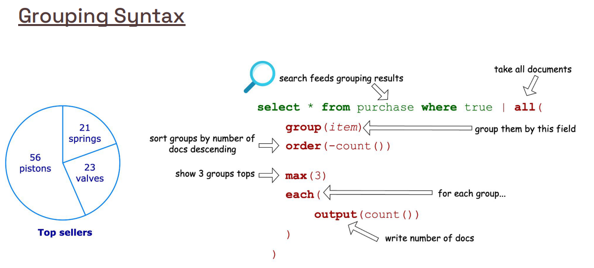
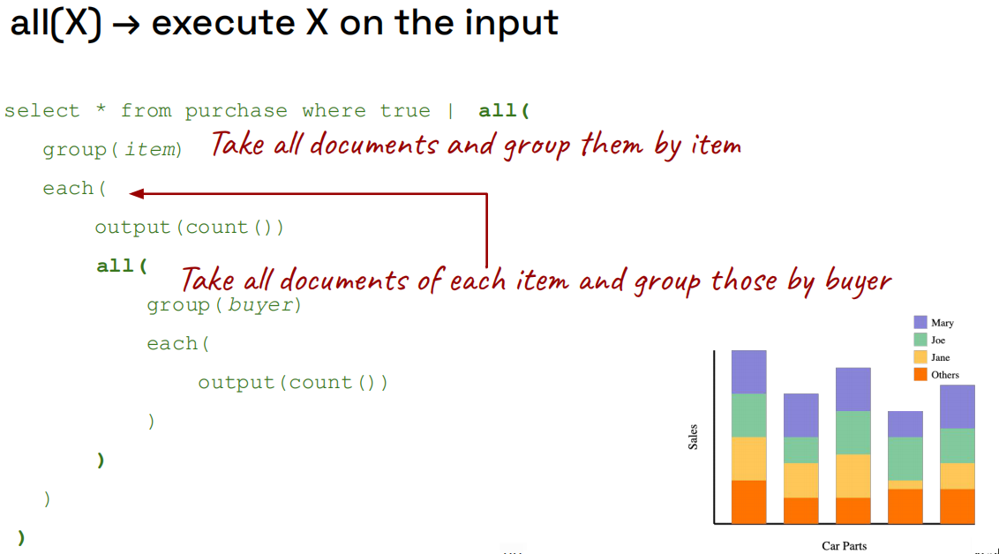
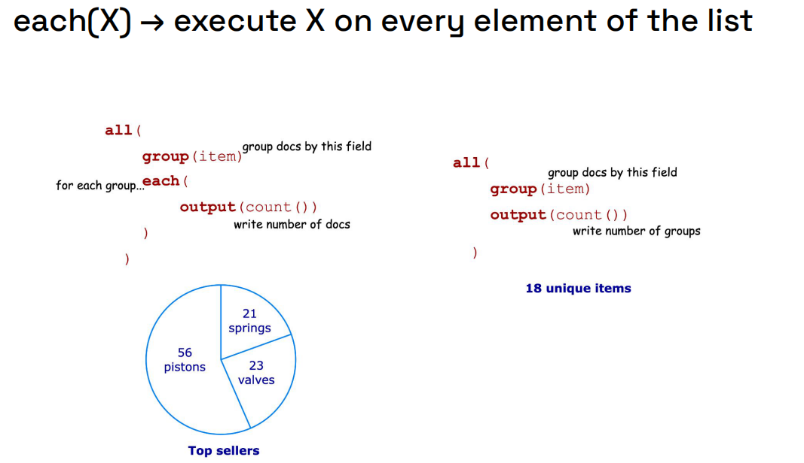
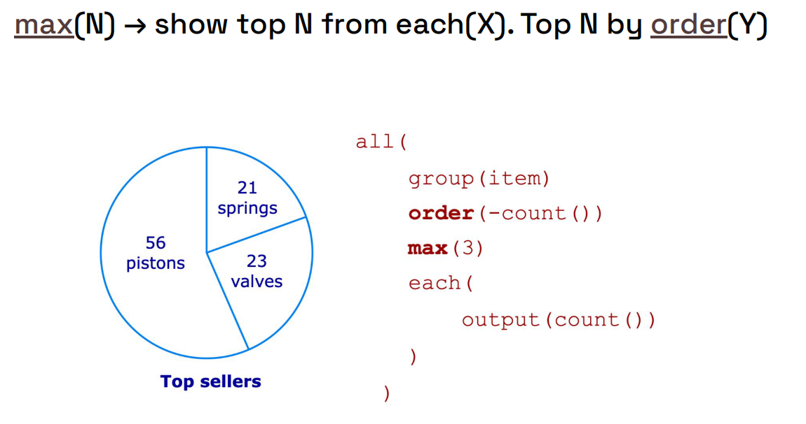
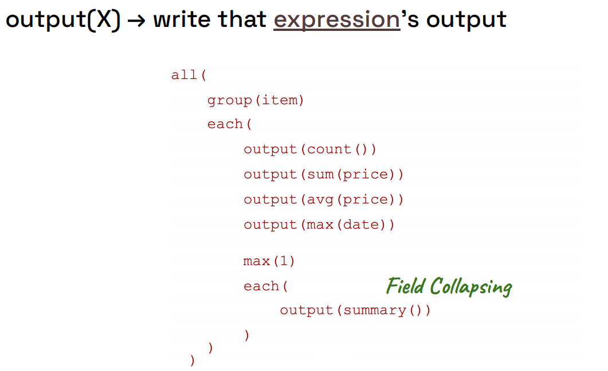
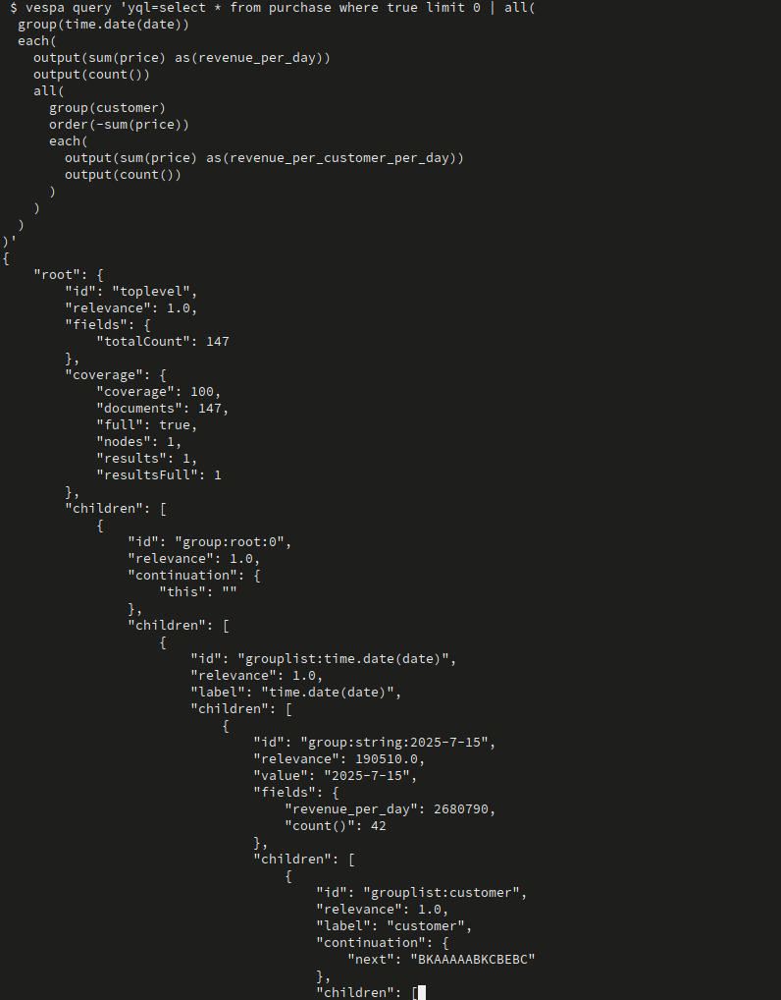
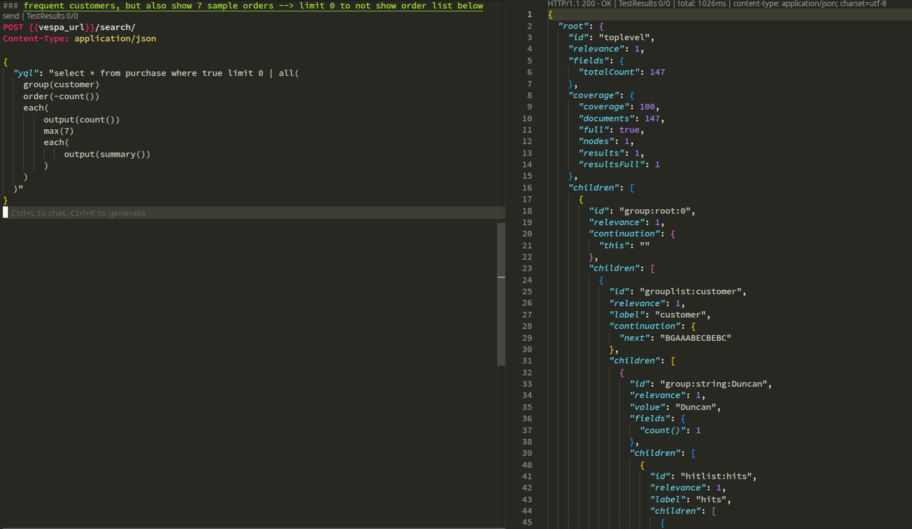

# Sales Data App – Vespa 101 Chapter 5

This project is **Chapter 5** in the Vespa 101 series.  
This chapter introduces **grouping and aggregation** in Vespa, allowing you to analyze sales data by breaking it down into groups, computing statistics, and exploring nested relationships.

The goal here is to learn how to:
- Use **grouping** to break down data by fields
- Use **aggregation functions** to compute statistics on grouped data
- Use **nested grouping** to explore data hierarchies
- Show **sample results from each group** for diversification
- Work with **time expressions** for date-based grouping

---

## Learning Objectives (Chapter 5)

After completing this chapter you should be able to:

- **Group data by fields** using the `group()` function
- **Compute aggregations** (count, sum, avg, etc.) on grouped data
- **Order groups** by aggregation results
- **Use nested grouping** to create hierarchical data structures
- **Extract sample documents** from each group using `output(summary())`
- **Work with time expressions** for date-based grouping
- **Understand grouping syntax** and available aggregators

**Prerequisites**: Complete previous chapters first. If you haven't, review:
- [`simple_ecommerce_app/README.md`](https://github.com/vespauniversity/vespaworkshop101/tree/main/simple_ecommerce_app) for basic schema and queries
- [`ecommerce_app/README.md`](https://github.com/vespauniversity/vespaworkshop101/tree/main/ecommerce_app) for text search fundamentals
- [`semantic_ecommerce_app/README.md`](https://github.com/vespauniversity/vespaworkshop101/tree/main/semantic_ecommerce_app) for semantic search
- [`hybrid_ecommerce_app/README.md`](https://github.com/vespauniversity/vespaworkshop101/tree/main/hybrid_ecommerce_app) for hybrid search and RRF

---

## Project Structure

From the `sales_data_app` root:

```text
sales_data_app/
├── app/
│   ├── schemas/
│   │   └── purchase.sd              # Purchase schema with sales data fields
│   ├── services.xml                 # Vespa services config
│   └── validation-overrides.xml     # Validation overrides
├── dataset/
│   └── sales-data.jsonl             # Sales data in JSONL format
├── queries.cli                      # Example grouping queries (CLI)
├── queries.http                     # Example grouping queries (REST)
└── README.md                        # This file
```

You will mainly work with:
- `app/schemas/purchase.sd` - Schema defining purchase documents
- `dataset/sales-data.jsonl` - Sales data to feed
- `queries.cli` or `queries.http` - Example grouping queries

---

## Key Concepts

### What is Grouping?

**Grouping** in Vespa allows you to:
- **Group documents** by field values (e.g., group purchases by customer)
- **Compute aggregations** on each group (e.g., count, sum, average)
- **Order groups** by aggregation results
- **Create nested groups** for hierarchical analysis
- **Extract sample documents** from each group

**Example**:
- Group purchases by `customer`
- Count purchases per customer
- Order by count (descending)
- Show top 7 customers

### Grouping Syntax

Grouping uses the `| all()` operator in YQL:

```yql
select * from purchase where true | all(
  group(customer)
  order(-count())
  max(7)
  each(
    output(count())
  )
)
```

**Components**:
- `group(field)` - Groups documents by field value
- `order(-aggregation)` - Orders groups (negative = descending)
- `max(n)` - Limits number of groups returned
- `each()` - Processes each group
- `output(aggregation)` - Outputs aggregation results

### Aggregation Functions

Common aggregation functions:
- **`count()`** - Number of documents in group
- **`sum(field)`** - Sum of field values
- **`avg(field)`** - Average of field values
- **`max(field)`** - Maximum value
- **`min(field)`** - Minimum value

### Nested Grouping

Nested grouping creates hierarchical structures:

```yql
select * from purchase where true | all(
  group(time.date(date))
  each(
    output(sum(price))
    all(
      group(customer)
      each(
        output(sum(price))
      )
    )
  )
)
```

**How it works**:
1. First level: Groups by date
2. Second level: Within each date, groups by customer
3. Outputs aggregations at each level

### Time Expressions

Vespa supports time expressions for date-based grouping:

- **`time.date(date)`** - Groups by date (day)
- **`time.month(date)`** - Groups by month
- **`time.year(date)`** - Groups by year
- **`time.dayOfWeek(date)`** - Groups by day of week

**For detailed information**, see:
- [Time Expressions Reference](https://docs.vespa.ai/en/reference/grouping-syntax.html#time-expressions)
- [Time Expression Examples](https://docs.vespa.ai/en/grouping.html?mode=cloud#time-and-date)

### Field Collapsing

Field collapsing allows you to show sample documents from each group:

```yql
select * from purchase where true | all(
  group(customer)
  each(
    output(count())
    max(7)
    each(
      output(summary())
    )
  )
)
```

**How it works**:
- Groups by customer
- Outputs count per customer
- Shows up to 7 sample purchase documents per customer

**For detailed information**, see: [Nested Groups and Field Collapsing](https://docs.vespa.ai/en/grouping.html#nested-groups)

---

## Overview

This section introduces the fundamental concepts of grouping and aggregation in Vespa. Grouping allows you to break down data into groups, compute statistics, and explore hierarchical relationships. If you're new to grouping, we recommend reading the detailed explanations in [`docs/GROUPING.md`](docs/GROUPING.md) for a deeper understanding.

### Grouping Syntax Overview



**What you're seeing:** This diagram illustrates the **grouping syntax** in Vespa. Grouping uses the `| all()` operator in YQL to organize documents into groups and compute aggregations. The syntax follows a hierarchical structure where you define groups, apply aggregations, and control output.

**Key Concepts:**
- **`all()` Operator**: Starts a grouping block after the WHERE clause
- **`group(field)`**: Groups documents by field value (e.g., `group(customer)`, `group(item)`)
- **`order(aggregation)`**: Orders groups by aggregation result (negative = descending)
- **`max(n)`**: Limits the number of groups or documents returned
- **`each()`**: Processes each group or document in a group
- **`output(aggregation)`**: Outputs aggregation results or document summaries

**Notes:** Think of it like this:
- **`all()`** = Start a grouping operation (like SQL GROUP BY)
- **`group(field)`** = How to organize documents (e.g., by customer, by date)
- **`each()`** = Process each group one by one
- **`output()`** = What statistics or data to return
- **`max(n)`** = Limit how many results to show

**Example Grouping Query:**
```yql
select * from purchase where true | all(
  group(customer)
  order(-count())
  max(7)
  each(
    output(count())
  )
)
```

This query groups purchases by customer, orders by count (descending), limits to top 7 customers, and outputs the count per customer.

**Learn More:**
- Official Docs: [Grouping](https://docs.vespa.ai/en/grouping.html)
- Official Docs: [Grouping Syntax Reference](https://docs.vespa.ai/en/reference/grouping-syntax.html)

### All Function Overview



**What you're seeing:** This diagram illustrates how the **`all()` function** works in Vespa grouping. The `all()` operator is the entry point for grouping operations and can be nested to create hierarchical grouping structures.

**Key Concepts:**
- **`all()` Operator**: Starts a grouping block, must come after the WHERE clause
- **Nested `all()`**: Can nest multiple `all()` blocks for hierarchical grouping
- **Group Scope**: Each `all()` block defines its own grouping scope
- **Hierarchical Structure**: Outer `all()` groups by one field, inner `all()` groups by another within each outer group

**Notes:** Think of it like this:
- **`all()`** = "Process all matching documents and group them"
- **Nested `all()`** = "Within each group, create sub-groups"
- **Scope** = Each `all()` block operates on its parent group's documents

**Example Nested Grouping:**
```yql
select * from purchase where true | all(
  group(time.date(date))
  each(
    output(sum(price))
    all(
      group(customer)
      each(
        output(sum(price))
      )
    )
  )
)
```

This creates a two-level hierarchy: first groups by date, then within each date group, groups by customer.

**Learn More:**
- Official Docs: [Nested Groups](https://docs.vespa.ai/en/grouping.html#nested-groups)
- Official Docs: [Grouping Syntax Reference](https://docs.vespa.ai/en/reference/grouping-syntax.html)

### Each Function Overview



**What you're seeing:** This diagram illustrates how the **`each()` function** works in Vespa grouping. The `each()` function processes each group (or each document within a group) and applies operations like aggregations or field collapsing.

**Key Concepts:**
- **`each()` Function**: Processes each group or document in sequence
- **Group-level `each()`**: Processes each group created by `group(field)`
- **Document-level `each()`**: Processes each document within a group (for field collapsing)
- **Nested `each()`**: Can nest `each()` blocks to process groups and then documents within groups

**Notes:** Think of it like this:
- **`each()`** = "For each group, do something"
- **First `each()`** = Process each group (e.g., compute aggregations)
- **Second `each()`** = Process each document in the group (e.g., show sample documents)
- **Nested `each()`** = First process groups, then process documents within each group

**Example with Nested `each()`:**
```yql
select * from purchase where true | all(
  group(customer)
  each(
    output(count())
    max(7)
    each(
      output(summary())
    )
  )
)
```

The first `each()` processes each customer group and computes the count. The second `each()` (nested) processes up to 7 documents within each customer group and outputs their summaries.

**Learn More:**
- Official Docs: [Field Collapsing](https://docs.vespa.ai/en/grouping.html#nested-groups)
- Official Docs: [Grouping Syntax Reference](https://docs.vespa.ai/en/reference/grouping-syntax.html)

### Max Function Overview



**What you're seeing:** This diagram illustrates how the **`max()` function** works in Vespa grouping. The `max()` function limits the number of groups or documents returned, controlling the result set size for performance and relevance.

**Key Concepts:**
- **`max(n)` in Group Context**: Limits the number of groups returned (e.g., `max(7)` returns top 7 groups)
- **`max(n)` in Document Context**: Limits the number of documents returned per group (for field collapsing)
- **Ordering**: Works with `order()` to return top-N groups based on aggregation results
- **Performance**: Limiting results improves query performance and reduces response size

**Notes:** Think of it like this:
- **`max(n)` at group level** = "Show only the top N groups" (e.g., top 7 customers)
- **`max(n)` at document level** = "Show only N sample documents per group" (e.g., 7 purchases per customer)
- **With `order()`** = Returns top-N based on the ordering criteria
- **Without `order()`** = Returns first N groups (order may be undefined)

**Example Usage:**
```yql
select * from purchase where true | all(
  group(customer)
  order(-count())
  max(7)
  each(
    output(count())
  )
)
```

This returns the top 7 customers (ordered by purchase count, descending).

**Learn More:**
- Official Docs: [Grouping Syntax Reference](https://docs.vespa.ai/en/reference/grouping-syntax.html)
- Official Docs: [Grouping](https://docs.vespa.ai/en/grouping.html)

### Output Function Overview



**What you're seeing:** This diagram illustrates how the **`output()` function** works in Vespa grouping. The `output()` function specifies what data to return - either aggregation results (like count, sum) or document summaries.

**Key Concepts:**
- **`output(aggregation)`**: Outputs aggregation results (e.g., `output(count())`, `output(sum(price))`)
- **`output(summary())`**: Outputs document summaries (for field collapsing to show sample documents)
- **Multiple `output()` Calls**: Can use multiple `output()` calls to return multiple aggregations
- **Aliasing**: Can alias output using `as(name)` (e.g., `output(sum(price) as(revenue))`)

**Notes:** Think of it like this:
- **`output(aggregation)`** = "Return this statistic" (e.g., count, sum, average)
- **`output(summary())`** = "Return sample documents from this group"
- **Multiple outputs** = Can return multiple statistics in one group
- **Aliasing** = Give a friendly name to the output (e.g., `revenue` instead of `sum(price)`)

**Example with Multiple Outputs:**
```yql
select * from purchase where true | all(
  group(item)
  each(
    output(sum(price) as(revenue))
    output(count())
    max(7)
    each(
      output(summary())
    )
  )
)
```

This outputs revenue (sum of price) and count per item, plus up to 7 sample purchase documents per item.

**What it does:**
- Computes aggregations on grouped data (count, sum, avg, etc.)
- Returns sample documents from each group for diversification
- Supports aliasing for readable output names
- Can combine multiple aggregations in a single group

**Learn More:**
- Official Docs: [Grouping Syntax Reference](https://docs.vespa.ai/en/reference/grouping-syntax.html)
- Official Docs: [Aggregation Functions](https://docs.vespa.ai/en/reference/grouping-syntax.html#aggregation-functions)
- Official Docs: [Field Collapsing](https://docs.vespa.ai/en/grouping.html#nested-groups)


---

## Step 1 – Review the Schema

Open:
- `app/schemas/purchase.sd`

### Schema Overview

The schema defines a `purchase` document type with the following fields:

```javascript
schema purchase {
  document purchase {
    field date type long {
      indexing: summary | attribute
    }
    field price type int {
      indexing: summary | attribute
    }
    field tax type double {
      indexing: summary | attribute
    }
    field item type string {
      indexing: summary | attribute
    }
    field customer type string {
      indexing: summary | attribute
    }
  }
}
```

**Fields**:
- **`date`** (long) - Purchase timestamp (Unix epoch)
- **`price`** (int) - Item price
- **`tax`** (double) - Tax amount
- **`item`** (string) - Item name
- **`customer`** (string) - Customer name

**Key points**:
- All fields are **attributes** (required for grouping)
- Fields are indexed as **summary** (for retrieval)
- No text indexing needed (this is about aggregation, not search)

**For detailed schema configuration**, see the schema file and Vespa documentation.

---

## Step 2 – Deploy the Application

From the `sales_data_app` root:

> **Assumption**: You already configured **target** and **application name** in previous chapters  
> (for example `vespa config set target cloud`, and `vespa config set application <tenant>.<app>[.<instance>]`).

If you **skipped previous chapters**, do that first using `ecommerce_app/README.md` (Prerequisites + Setup).

Then deploy this Chapter 5 app:

```bash
cd app

# Verify your application configuration
vespa config get target        # Should show: cloud

# Set the application target if it is not cloud
# $ vespa config set target cloud

vespa config get application   # Should show: tenant.app.instance

# Set the application name if it is not already set
# $ vespa config set application my-tenant.sales-data-app

# Login if needed
vespa auth login

# Create certificates if needed
vespa auth cert

# generate/copy the cert from .vespa dirs to this application if needed
# vespa auth cert add -f

# Deploy the application
vespa deploy --wait 900

# Check the status
vespa status
```

Wait for deployment to complete successfully.  
You should see output indicating the application is **ready**.

---

## Step 3 – Feed the Sample Data

The dataset contains sales/purchase data in JSONL format.

**File**: `dataset/sales-data.jsonl`

Each line is a JSON document representing a purchase with:
- `customer` - Customer name
- `item` - Item purchased
- `price` - Item price
- `tax` - Tax amount
- `date` - Purchase timestamp (Unix epoch)

### Feed the Data

```bash
# From the sales_data_app root directory
vespa feed --progress 3 ../dataset/sales-data.jsonl
```

**What this does**:
- Sends each JSONL line as a **put document** request to Vespa
- Documents are validated against the schema
- All fields are stored as attributes (ready for grouping)

### Verify Data Was Fed

Check that documents were successfully indexed:

```bash
vespa query 'yql=select * from purchase where true' 'hits=5'
```

You should see purchase documents with customer, item, price, tax, and date fields.

**If feeding fails**:
- Check error messages – usually means **field names/types don't match** your schema
- Verify schema fields match the JSONL data structure
- Check that all required fields are present

---

## Step 4 – Run Grouping Queries

Now that data is fed, you can perform **grouping and aggregation** queries.

### Option 1: Using Vespa CLI

**Basic grouping by customer**:

```bash
vespa query 'yql=select * from purchase where true | all(
  group(customer)
  max(7)
  each(
    output(count())
  )
)'
```

**Group by item, order by count (descending)**:

```bash
vespa query 'yql=select * from purchase where true limit 0 | all(
  group(item)
  order(-count())
  max(7)
  each(
    output(count())
  )
)'
```

**Group by item, order by revenue (sum of price)**:

```bash
vespa query 'yql=select * from purchase where true limit 0 | all(
  group(item)
  order(-sum(price))
  each(
    output(sum(price) as(revenue))
    output(count())
  )
)'
```

**Sales by day (nested grouping)**:

```bash
vespa query 'yql=select * from purchase where true limit 0 | all(
  group(time.date(date))
  each(
    output(sum(price) as(revenue_per_day))
    output(count())
    all(
      group(customer)
      order(-sum(price))
      each(
        output(sum(price) as(revenue_per_customer_per_day))
        output(count())
      )
    )
  )
)'
```



### Option 2: Using Query REST Client

Fill in the template in the file `queries.http` using a code editor (e.g., VS Code with REST Client plugin) and run the queries.

**The Example File**: `queries.http`

1. **Group by customer, show count**:
   ```json
   {
     "yql": "select * from purchase where true | all(
       group(customer)
       max(7)
       each(
         output(count())
       )
     )"
   }
   ```

2. **Group by item, order by count descending**:
   ```json
   {
     "yql": "select * from purchase where true limit 0 | all(
       group(item)
       order(-count())
       max(7)
       each(
         output(count())
       )
     )"
   }
   ```

3. **Group by item, order by revenue**:
   ```json
   {
     "yql": "select * from purchase where true limit 0 | all(
       group(item)
       order(-sum(price))
       each(
         output(sum(price) as(revenue))
         output(count())
       )
     )"
   }
   ```

4. **Sales by day with nested customer grouping**:
   ```json
   {
     "yql": "select * from purchase where true limit 0 | all(
       group(time.date(date))
       each(
         output(sum(price) as(revenue_per_day))
         output(count())
         all(
           group(customer)
           order(-sum(price))
           each(
             output(sum(price) as(revenue_per_customer_per_day))
             output(count())
           )
         )
       )
     )"
   }
   ```

5. **Top customers with sample orders**:
   ```json
   {
     "yql": "select * from purchase where true limit 0 | all(
       group(customer)
       order(-sum(price))
       each(
         output(sum(price) as(revenue))
         output(count())
         max(7)
         each(
           output(summary())
         )
       )
     )"
   }
   ```


**Note**: Replace `<mTLS_ENDPOINT_DNS_GOES_HERE>` with your Vespa Cloud endpoint (from `vespa status`).

### Understanding the Queries

**Components**:
- `group(field)` - Groups documents by field value
- `order(-aggregation)` - Orders groups (negative = descending)
- `max(n)` - Limits number of groups
- `each()` - Processes each group
- `output(aggregation)` - Outputs aggregation results
- `output(summary())` - Outputs sample documents from group
- `time.date(date)` - Groups by date using time expression

**Grouping syntax**:
- Uses `| all()` operator after the WHERE clause
- Can nest multiple `all()` blocks for hierarchical grouping
- Aggregations computed per group

**For detailed query syntax**, see:
- [Grouping Documentation](https://docs.vespa.ai/en/grouping.html)
- [Grouping Syntax Reference](https://docs.vespa.ai/en/reference/grouping-syntax.html)

---

## Step 5 – Complete the Exercises

Based on the learning objectives, complete these exercises:

### Exercise 1: The Most Sold Items

**Task**: Write a query to group orders by item and sort groups by count in descending order.

**Hint**: 
- Use `group(item)` to group by item
- Use `order(-count())` to sort by count descending
- Use `output(count())` to show the count per item

**Solution**:
```bash
vespa query 'yql=select * from purchase where true limit 0 | all(
  group(item)
  order(-count())
  each(
    output(count())
  )
)'
```

**Note**: Have a look at [grouping examples](https://docs.vespa.ai/en/grouping.html#more-examples) for inspiration.

### Exercise 2: Items Bringing Most Revenue

**Task**: Write a query to group orders by item, but this time sort groups by the sum of the price of items in the group.

**Hint**:
- Use `group(item)` to group by item
- Use `order(-sum(price))` to sort by total revenue descending
- Use `output(sum(price) as(revenue))` to show revenue
- Also output `count()` to show number of purchases

**Solution**:
```bash
vespa query 'yql=select * from purchase where true limit 0 | all(
  group(item)
  order(-sum(price))
  each(
    output(sum(price) as(revenue))
    output(count())
  )
)'
```

**Note**: Refer to the [grouping syntax documentation](https://docs.vespa.ai/en/reference/grouping-syntax.html) for available aggregators such as `sum`.

### Exercise 3: Sales by Day

**Task**: Write a query to group orders by day.

**Hint**:
- Use `group(time.date(date))` to group by date
- Use `output(sum(price))` to show revenue per day
- Use `output(count())` to show number of purchases per day

**Solution**:
```bash
vespa query 'yql=select * from purchase where true limit 0 | all(
  group(time.date(date))
  each(
    output(sum(price) as(revenue_per_day))
    output(count())
  )
)'
```

**Note**: See [time expression examples](https://docs.vespa.ai/en/grouping.html?mode=cloud#time-and-date) for more date grouping options.

### Exercise 4: Nested Grouping (Advanced)

**Task**: Extend Exercise 3 to also show sales by customer within each day.

**Hint**:
- Use nested `all()` block inside the date group
- Group by customer within each date
- Output customer-level aggregations

**Solution**:
```bash
vespa query 'yql=select * from purchase where true limit 0 | all(
  group(time.date(date))
  each(
    output(sum(price) as(revenue_per_day))
    output(count())
    all(
      group(customer)
      order(-sum(price))
      each(
        output(sum(price) as(revenue_per_customer_per_day))
        output(count())
      )
    )
  )
)'
```

**Note**: See [nested grouping documentation](https://docs.vespa.ai/en/grouping.html#nested-groups) for more details.

### Exercise 5: Field Collapsing (Advanced)

**Task**: Show top customers by revenue, and for each customer, show up to 7 sample purchase orders.

**Hint**:
- Group by customer
- Order by sum of price
- Use `max(7)` and `output(summary())` to show sample documents

**Solution**:
```bash
vespa query 'yql=select * from purchase where true limit 0 | all(
  group(customer)
  order(-sum(price))
  each(
    output(sum(price) as(revenue))
    output(count())
    max(7)
    each(
      output(summary())
    )
  )
)'
```

**Note**: See [field collapsing documentation](https://docs.vespa.ai/en/grouping.html#nested-groups) for more details.

---

## Understanding Grouping

### How Grouping Works

**Grouping** in Vespa:
1. **Groups documents** by field values
2. **Computes aggregations** for each group
3. **Orders groups** by aggregation results
4. **Returns top groups** based on limits

**Example flow**:
- Input: 100 purchase documents
- Group by `customer`: Creates groups (e.g., "Smith": 20 docs, "Jones": 15 docs)
- Compute `count()`: Counts documents per group
- Order by `count()`: Sorts groups by size
- Return top 7: Shows 7 largest groups

### Aggregation Functions

**Available aggregators**:
- **`count()`** - Number of documents in group
- **`sum(field)`** - Sum of field values
- **`avg(field)`** - Average of field values
- **`max(field)`** - Maximum value
- **`min(field)`** - Minimum value
- **`stddev(field)`** - Standard deviation
- **`xth_percentile(field, percentile)`** - Percentile value

**For complete list**, see: [Grouping Syntax Reference](https://docs.vespa.ai/en/reference/grouping-syntax.html)

### Time Expressions

**Time expression functions**:
- **`time.date(date)`** - Groups by date (YYYY-MM-DD)
- **`time.month(date)`** - Groups by month (YYYY-MM)
- **`time.year(date)`** - Groups by year (YYYY)
- **`time.dayOfWeek(date)`** - Groups by day of week (0-6)
- **`time.hourOfDay(date)`** - Groups by hour (0-23)

**For detailed information**, see:
- [Time Expressions Reference](https://docs.vespa.ai/en/reference/grouping-syntax.html#time-expressions)
- [Time Expression Examples](https://docs.vespa.ai/en/grouping.html?mode=cloud#time-and-date)

### Nested Grouping

**Nested grouping** creates hierarchical structures:

```yql
all(
  group(level1_field)
  each(
    output(...)
    all(
      group(level2_field)
      each(
        output(...)
      )
    )
  )
)
```

**Use cases**:
- Sales by day, then by customer
- Products by category, then by brand
- Orders by region, then by store

**For detailed information**, see: [Nested Groups Documentation](https://docs.vespa.ai/en/grouping.html#nested-groups)

### Field Collapsing

**Field collapsing** shows sample documents from each group:

```yql
each(
  output(count())
  max(7)
  each(
    output(summary())
  )
)
```

**How it works**:
- First `each()`: Processes each group
- `max(7)`: Limits to 7 sample documents
- Second `each()`: Processes each document in group
- `output(summary())`: Outputs document fields

**For detailed information**, see: [Field Collapsing Documentation](https://docs.vespa.ai/en/grouping.html#nested-groups)

---

## Destroy The Deployment

**Note:** Destroy the application if needed:
   ```bash
   vespa destroy
   ```

---

## Troubleshooting

### Issue: Grouping Not Working

**Symptoms**: Query returns no groups or errors

**Solutions**:
1. **Verify fields are attributes**: Grouping requires attribute fields
2. **Check field names**: Ensure field names match schema
3. **Verify data exists**: Query should match documents (`where true`)
4. **Check syntax**: Ensure proper `| all()` syntax

### Issue: Aggregation Returns Wrong Values

**Symptoms**: Sum, count, or other aggregations are incorrect

**Solutions**:
1. **Check field types**: Ensure numeric fields are correct type (int, long, double)
2. **Verify data format**: Ensure data values are valid numbers
3. **Check null handling**: Missing values may affect aggregations
4. **Test with simple query**: Start with `count()` to verify grouping works

### Issue: Time Expression Not Working

**Symptoms**: `time.date()` or other time functions fail

**Solutions**:
1. **Verify date field type**: Must be `long` (Unix timestamp)
2. **Check date values**: Ensure dates are valid Unix timestamps
3. **Verify syntax**: Use `time.date(date)` not `time.date(date_field)`
4. **Test with simple grouping**: Try grouping by date field directly first

### Issue: Nested Grouping Too Complex

**Symptoms**: Query is slow or returns errors

**Solutions**:
1. **Simplify nesting**: Start with 2 levels, add more gradually
2. **Limit groups**: Use `max(n)` to limit groups at each level
3. **Check data size**: Large datasets may need optimization
4. **Test incrementally**: Build nested query step by step

### Issue: Field Collapsing Not Showing Documents

**Symptoms**: `output(summary())` returns no documents

**Solutions**:
1. **Verify `limit 0`**: Use `limit 0` to avoid showing base query results
2. **Check `max(n)`**: Ensure `max(n)` is set before `output(summary())`
3. **Verify summary fields**: Ensure fields are in summary
4. **Test with simple query**: Start with basic grouping first

---

## What You've Learned in Chapter 5

By completing this app, you have:

- Learned how to **group documents by fields** using `group()`
- Computed **aggregations** (count, sum, avg) on grouped data
- **Ordered groups** by aggregation results
- Used **nested grouping** to create hierarchical structures
- Worked with **time expressions** for date-based grouping
- Extracted **sample documents** from groups using field collapsing
- Understood **grouping syntax** and available aggregators

From here, you are ready for more advanced topics:
- **Advanced aggregations** (percentiles, standard deviation)
- **Complex nested structures** (multi-level hierarchies)
- **Performance optimization** (grouping on large datasets)
- **Combining grouping with search** (grouping filtered results)

---

## Additional Resources

### Documentation

- **Grouping Guide**: https://docs.vespa.ai/en/grouping.html
- **Grouping Syntax Reference**: https://docs.vespa.ai/en/reference/grouping-syntax.html
- **Grouping Examples**: https://docs.vespa.ai/en/grouping.html#more-examples
- **Time Expressions**: https://docs.vespa.ai/en/reference/grouping-syntax.html#time-expressions
- **Time Expression Examples**: https://docs.vespa.ai/en/grouping.html?mode=cloud#time-and-date
- **Nested Groups**: https://docs.vespa.ai/en/grouping.html#nested-groups
- **Field Collapsing**: https://docs.vespa.ai/en/grouping.html#nested-groups

### Related Tutorials

- **Chapter 1**: [`simple_ecommerce_app/README.md`](https://github.com/vespauniversity/vespaworkshop101/tree/main/simple_ecommerce_app) - Basic schema and queries
- **Chapter 2**: [`ecommerce_app/README.md`](https://github.com/vespauniversity/vespaworkshop101/tree/main/ecommerce_app) - Full catalog with text search
- **Chapter 3**: [`semantic_ecommerce_app/README.md`](https://github.com/vespauniversity/vespaworkshop101/tree/main/semantic_ecommerce_app) - Semantic search with pre-computed embeddings
- **Chapter 4**: [`hybrid_ecommerce_app/README.md`](https://github.com/vespauniversity/vespaworkshop101/tree/main/hybrid_ecommerce_app) - Hybrid search with RRF

### Query Examples

- `queries.cli` - Example grouping queries (CLI format)
- `queries.http` - Example grouping queries (REST API format)

---

## Summary

This chapter introduced:

1. **Grouping** - Breaking down data by fields using `group()`
2. **Aggregations** - Computing statistics (count, sum, avg) on groups
3. **Ordering groups** - Sorting groups by aggregation results
4. **Nested grouping** - Creating hierarchical data structures
5. **Time expressions** - Grouping by date, month, year using `time.date()`
6. **Field collapsing** - Showing sample documents from each group

**Key takeaway**: Grouping and aggregation in Vespa provide powerful analytics capabilities, allowing you to analyze data at different levels of granularity and create hierarchical views of your data.

For detailed technical reference, see the Vespa documentation links above.
