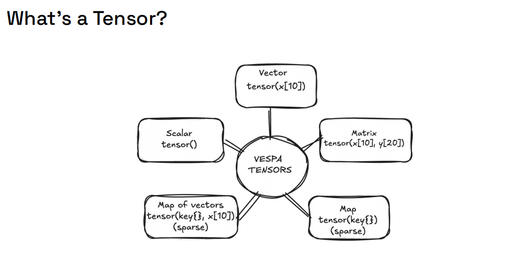
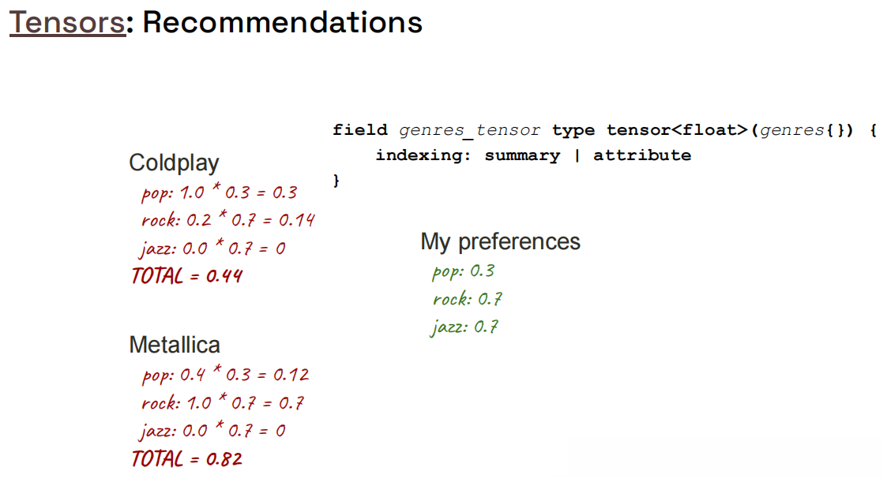
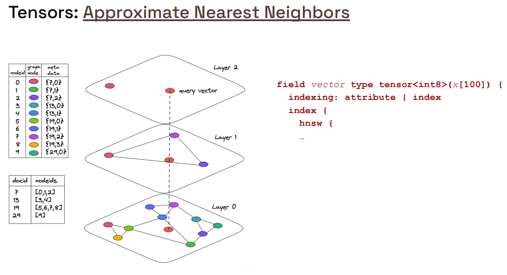
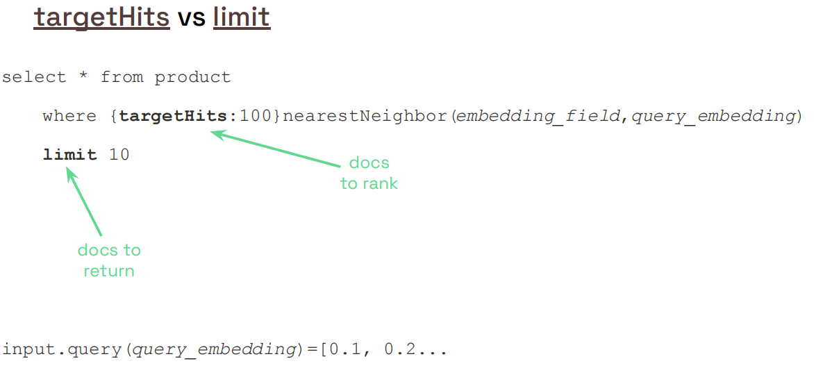

# Semantic E-commerce App – Vespa 101 Chapter 3

This project is **Chapter 3** in the Vespa 101 series.  
Chapter 2 ([`ecommerce_app`](https://github.com/vespauniversity/vespaworkshop101/tree/main/ecommerce_app)) introduced a full product catalog with text search.  
This chapter adds **semantic search** using embedding tensors and **Approximate Nearest Neighbor (ANN)** search with HNSW indexing.

---

## Learning Objectives (Chapter 3)

After completing this chapter you should be able to:

- **Understand embedding fields** and tensor types in Vespa schemas
- **Configure HNSW indexing** for approximate nearest neighbor search
- **Feed documents with embedding tensors** (pre-computed)
- **Query using `nearestNeighbor()`** operator for semantic search
- **Use `closeness()` ranking** to score semantic similarity based on embedding tensors.
- **Combine text and semantic search** for hybrid retrieval

**Prerequisites**: Complete Chapter 2 (`ecommerce_app`) first. If you haven't, review:
- [`ecommerce_app/README.md`](https://github.com/vespauniversity/vespaworkshop101/tree/main/ecommerce_app) for schema and ranking basics and queries
- [`simple_ecommerce_app/README.md`](https://github.com/vespauniversity/vespaworkshop101/tree/main/simple_ecommerce_app) for fundamental concepts

---

## Project Structure

From the `semantic_ecommerce_app` root:

```text
semantic_ecommerce_app/
├── app/
│   ├── schemas/
│   │   └── product.sd              # Product schema with embedding field
│   ├── services.xml                # Vespa services config
│   └── validation-overrides.xml    # Validation overrides (used sparingly)
├── dataset/
│   └── products.jsonl              # Products with pre-computed embeddings
├── queries.http                    # Example ANN queries
├── query-template.http             # Template for building ANN queries
└── README.md                       # This file
```

You will mainly work with:
- `app/schemas/product.sd` - Schema with embedding field and HNSW configuration
- `dataset/products.jsonl` - Data with embeddings (384-dimensional vectors)
- `query-template.http` - Template for ANN queries

---

## Key Concepts

### What is Semantic Search?

**Semantic search** finds documents based on **meaning** rather than exact keyword matches. It uses **tensor embedding fields** (dense numerical representations) to capture semantic relationships.

**Example**:
- Traditional search: "blue jeans" only matches documents containing those exact words
- Semantic search: "blue jeans" can match "denim pants", "navy trousers", etc., based on meaning

### Embeddings

- **Dense tensors** 
- Generated by ML models (e.g., E5, BERT, sentence-transformers)
- Similar meanings → similar embedding tensors → small distance in embedding space

### HNSW (Hierarchical Navigable Small World)

- **Graph-based index** for fast approximate nearest neighbor search
- Balances **speed**, **accuracy**, and **memory**
- Configurable via `max-links-per-node` (`M` in other implementations) and `neighbors-to-explore-at-insert` (`efconstruction` in other implementations)

### ANN Search

- **Approximate Nearest Neighbor** search finds similar embedding tensors quickly
- Uses `nearestNeighbor()` operator in YQL
- Controlled by `targetHits`: how many candidate hits ANN should aim to retrieve

**For detailed documentation**, see: [`ANN_SEARCH`](https://docs.vespa.ai/en/querying/approximate-nn-hnsw.html)

---

## Overview

This section introduces the fundamental concepts of tensors, embeddings, and semantic search in Vespa. If you're new to vector search, we recommend reading the detailed explanations in [`ANN_SEARCH`](https://docs.vespa.ai/en/querying/approximate-nn-hnsw.html) for a deeper understanding.

### Tensor Overview



**What you're seeing:** This diagram illustrates what **tensors** are in Vespa. Tensors are multi-dimensional arrays that can represent scalars, vectors, matrices, or higher-dimensional data structures. In semantic search, tensors are used to represent ** embeddings** - numerical representations of text, images, or other data.

**Key Concepts:**
- **Tensor**: A multi-dimensional array (0D = scalar, 1D = vector, 2D = matrix, etc.)
- **Tensor Type**: Defines the shape and data type, e.g. `tensor<float>(x[384])`
- **Embeddings**: Dense tensor representations that capture semantic meaning
- **Vector Space (vectors are first order tensors)**: High-dimensional space where semantically similar tensors are close under a distance metric

**Example Tensor Definition:**
```vespa
field embedding type tensor<float>(x[384]) {
  indexing: attribute | index | summary
}
```

This defines a 384-dimensional dense tensor suitable for semantic search using ANN.

**Learn More:**
- Blog: [Computing with Tensors](https://blog.vespa.ai/computing-with-tensors/)
- Official Docs: [Tensor Examples](https://docs.vespa.ai/en/ranking/tensor-examples.html)

### Tensor Recommendation Overview



**What you're seeing:** This diagram illustrates how tensors are used for **recommendation systems** in Vespa. Recommendation systems use tensor operations to compute similarity between users and items, or to combine multiple features for personalized ranking.

**Key Concepts:**
- **User Preferences Tensor**: Vector (first order tensor) representing user interests or preferences
- **Item Features Tensor**: Vector (first order tensor) representing item characteristics
- **Tensor Operations**: Dot product, element-wise operations, aggregation functions
- **Personalized Ranking**: Using tensor computations to score items for specific users

**Notes:** Think of it like this:
- **User Tensor (query tensor)** = A profile of what the user likes (e.g., `[0.8, 0.2, 0.9, ...]` for categories)
- **Item Tensors (document attribute tensors)** = Features of the product (e.g., `[0.7, 0.3, 0.6, ...]` for same categories)
- **Similarity Score** = Dot product or cosine similarity between user and item tensors
- **Higher Score** = Better match for the user

**Example Usage:**
```vespa
rank-profile personalized {
  inputs {
    query(user_preferences) tensor<float>(features{})
  }
  first-phase {
    expression: sum(query(user_preferences) * attribute(ProductFeatures))
  }
}
```

This computes a personalized relevance score using a dot product between user and item feature tensors.

**Learn More:**
- Official Docs: [Tensor User Guide](https://docs.vespa.ai/en/ranking/tensor-user-guide.html)

### Tensor Semantic Search Overview


**What you're seeing:** This diagram illustrates how tensors enable **semantic search** in Vespa. Semantic search uses embedding tensors to find documents based on meaning rather than exact keyword matches. The query and documents are converted to embeddings, and similarity is computed using distance metrics.

**Key Concepts:**
- **Query Embedding**: 1-D dense tensor, passed as a query input, e.g. "blue jeans" → **Embedding** `[0.1, -0.3, 0.5, ...]`
- **Document Embedding**: 1-D dense tensor representation of document content (stored in schema), e.g. "denim pants" → **Embedding** `[0.12, -0.28, 0.48, ...]`
- **Distance Metric**: How to measure distance (angular/cosine, euclidean, hamming)
- **Nearest Neighbor Search**: Computes similarity by evaluating distance metrics over these tensors

**Example Query:**
```yql
select * from product where ({targetHits:100}nearestNeighbor(embedding, q_embedding))
```

This retrieves 100 documents whose embedding tensors are closest to the query embedding tensor.

**Learn More:**
- Official Docs: [Nearest Neighbor Search](https://docs.vespa.ai/en/querying/nearest-neighbor-search.html)

### Approximate Nearest Neighbors (ANN) Overview



**What you're seeing:** This diagram explains **Approximate Nearest Neighbor (ANN)** search and the **HNSW (Hierarchical Navigable Small World)** indexing algorithm. ANN search provides fast similarity search over tensor fields by using approximate algorithms instead of exact (brute-force) search.

**Key Concepts:**
- **ANN Search**: Fast approximate algorithm to find tensor embeddings (trades some accuracy for speed)
- **HNSW Index**: Graph-based index organizing tensor embeddings for efficient nearest-neighbor traversal 
- **Exact vs Approximate**: Exact search is slow but 100% accurate; ANN is fast but may miss some results
- **Recall vs Speed Trade-off**: Higher recall = slower search, lower recall = faster search

**Notes:** Think of it like this:
- **Exact Search** = Check every document (slow, but perfect accuracy)
- **ANN Search** = Use a smart graph structure to jump to likely matches (fast, ~90% accuracy yet not guranteed)
- **HNSW Graph** = Like a highway system: you can quickly navigate to nearby neighborhoods
- **targetHits** = How many nearest-neighbor candidates ANN should aim to retrieve (more = better recall, slower)

**HNSW Configuration:**
```vespa
index {
  hnsw {
    max-links-per-node: 16        # Connections per node. more = better recall, more memory (`M` in other implementations)
    neighbors-to-explore-at-insert: 200  # Candidates to check when inserting (`efConstruction` in other implementations)
  }
}
```

**When to Use ANN:**
- ✅ Large vector datasets (millions+ documents)
- ✅ Need fast query response times
- ✅ Can tolerate some recall loss in exchange for lower latency
- ✅ Real-time search applications

**Learn More:**
- Official Docs: [Nearest Neighbor Search Guide](https://docs.vespa.ai/en/querying/nearest-neighbor-search-guide.html)

### Target Hit and Limit Overview



**What you're seeing:** This diagram explains the difference between **`targetHits`** and **`limit`** parameters in Vespa queries. These are two different parameters that control different aspects of query execution and result retrieval.

**Key Concepts:**
- **`targetHits`**: Controls how many nearest-neighbor candidates the ANN retrieval phase should attempt to find (affects recall and speed)
- **`limit`**: Controls how many results are returned to the user (affects output size)
- **Retrieval Phase**: `targetHits` affects the number of documents retrieved from the index
- **Ranking Phase**: `limit` affects how many of the retrieved documents are returned

**Notes:** Think of it like this:
- **`targetHits`** = "Look at 100 candidates" (retrieval phase - how many to consider. It is approximate and best-effort, not exact)
- **`limit`** = "Return top 10 results" (output phase - how many to show)
- **Higher `targetHits`** = Better recall, slower query (more candidates to rank)
- **Lower `targetHits`** = Faster query, may miss some relevant results

**Example Query:**
```yql
select * from product 
where ({targetHits:100}nearestNeighbor(embedding, q_embedding))
limit 10
```

**What happens:**
1. ANN algorithm aims to find ~100 nearest-neighbor candidates (`targetHits:100`)
2. These candidates are ranked using the ranking profile
3. Top 10 results are returned (`limit 10`)

**Best Practices:**
- Set `targetHits` to 3-10x your desired `limit` (e.g., `targetHits:100` for `limit:10`. This is a common industry guidance, not a rule)
- Higher `targetHits` improves recall but increases latency

**Learn More:**
- Official Docs: [targetHits](https://docs.vespa.ai/en/reference/querying/yql.html#targethits)
- Official Docs: [limit/offset](https://docs.vespa.ai/en/reference/querying/yql.html#limit-offset)

## Lab

## Step 1 - Tensor Playground

Visit [example dot product tensor playground](https://docs.vespa.ai/playground/#N4KABGBEBmkFxgNrgmUrWQPYAd5QGNIAaFDSPBdDTAF30gGUcBDAJwGcBTMWrgOw5Y2YACZZaYHGyyiArgVoA6MADEAlp1rEwAdx6iu0dfx61dWMB1aczAoZzAADAIJOwLfqOcAhJyoAdfgA5CXUCMwALHgiAG1iOXkiWSWSANwEAckkAIy4BMSMTLm9xLkT+CTB0nhYwNJZYuS44SDJUAF92jtIManJcBi4SdogKfH6aSH4GFxGaTGGESD5BYQAKAhTgDoBKOGBoLCw4AAYlAA4OtoWujB72ybHB5eHeqco0UcwZ5Z95hZQJZQVYOTbbPYHHLsM5KADsAFZiEcTucAEzXb53TrvCBPKAvQgA8iffFjejLACS-CSPAAtnJYrR1DhYuEUuosPwdFzYgBPWlgOkpAiREwAczAcQSHjYMUaBEZKRKrSx3VxXwW2E+kDe33GVG+Y1+UGJU2BkBcYAAVGB-mr7hr8dqGEQNWNSUaQQwACrRMRVaSyBSSdSJWj+hlMllsrbMrlgI7xLD6bw5AV1DhyOlgLAZEQRmJYOl0hOidR0+yc-iq27qx76wm6s0eiZe6YMFuLBhZunrFzWnw6OO7G40bEQB59Rs6t36z2A73LP1hsCrrgARzk6gasQEkloJzH93r061Tb1WoXgI7yy7YwtcvkEXWACssCZ+zoh4n1gAPYg+V2f9rSA3YdF7YcUlHB1OhQABdEAOiAA)  

Input tensors that look like this:

```
{
    "pop": 1,
    "rock": 0.2,
    "jazz": 0
}
```

To represent musical genres of different bands. Then you'll express your taste using a similar tensor:
```
{
    "pop": 0.5,
    "rock": 0.7,
    "jazz": 0.3
}
```

Finally, you'll compute the dot product between the taste tensor and the band tensors. The highest dot products would be the bands to recommend.

Feel free to look at other examples from the [Tensor Playground](https://docs.vespa.ai/playground/) and play around with them.

## Step 2 – Review the Schema

Open:
- `app/schemas/product.sd`

This schema extends Chapter 2's schema with an **embedding field**:

```javascript
field embedding type tensor<float>(x[384]) {
  indexing: attribute | index | summary
  attribute {
    distance-metric: prenormalized-angular
  }
  index {
    hnsw {
      max-links-per-node: 16
      neighbors-to-explore-at-insert: 200
    }
  }
}
```

### Key Components

1. **Tensor Type**: `tensor<float>(x[384])` - 384-dimensional float vector
2. **Indexing**: 
   - `attribute` - For distance computation
   - `index` - For HNSW graph structure
   - `summary` - For debugging (remove in production)
3. **Distance Metric**: `prenormalized-angular` - Cosine similarity for normalized vectors
4. **HNSW Configuration**: Tuned for balanced performance

### Ranking Profiles

The schema includes three ranking profiles:

1. **`use_bm25`**: Text-only ranking (from Chapter 2)
2. **`use_closeness`**: Semantic similarity ranking
   ```javascript
   rank-profile use_closeness {
     inputs {
       query(q_embedding) tensor<float>(x[384])
     }
     first-phase {
       expression: closeness(field, embedding)
     }
   }
   ```
3. **`hybrid`**: Combines text (BM25) + semantic (closeness)


---

## Step 3 – Deploy the Application

From the `semantic_ecommerce_app` root:

> **Assumption**: You already configured **target** and **application name** in previous chapters  
> (for example `vespa config set target cloud`, and `vespa config set application <tenant>.<app>[.<instance>]`).

If you **skipped previous chapters**, do that first using `ecommerce_app/README.md` (Prerequisites + Setup).

Then deploy this Chapter 3 app:

```bash
cd app

# Verify your application configuration
vespa config get target        # Should show: cloud

# Set the application target if it is not cloud
# $ vespa config set target cloud

vespa config get application   # Should show: tenant.app.instance

# Set the application name if it is not already set
# $ vespa config set application my-tenant.ecommerce-app

# Login if needed
vespa auth login

# Create certificates if needed
vespa auth cert

# generate/copy the cert from .vespa dirs to this application if needed
# vespa auth cert add -f

# Deploy the application
vespa deploy --wait 900

# Check the status
vespa status
```

Wait for deployment to complete successfully.  
You should see output indicating the application is **ready**.

**Note**: The schema includes HNSW indexing, which may take longer to initialize than text-only indexes.

---

## Step 4 – Delete Existing Documents (If Any)

> **Important**: If you have existing documents from Chapter 2, delete them first to avoid conflicts or setup the new application.

### Option 1: Using Vespa Cloud Console

1. Go to your application in [Vespa Cloud](https://console.vespa.ai/)
2. Navigate to the **Metrics** section
3. Find the **Documents** count
4. Click **"(delete)"** to remove all documents


**Note**: Deleting documents may take a while. Give it half a minute to complete before feeding data in the next step.

### Option 2: Using Document API

You can also use the Document v1 API to delete documents programmatically:

```bash
# Delete all documents (example - adjust document IDs to match your data)
vespa document remove id:ecommerce:product::1
vespa document remove id:ecommerce:product::2
```

### Option 3: Query and Delete

```bash
# First, query to see what documents exist
vespa query 'yql=select * from product where true'

# Then delete specific documents by ID
vespa document remove <document-id>
```

### Option 4: Bulk Delete Script

```bash
# Using a loop to delete all document IDs
# This script queries all documents, extracts their IDs, and deletes them using jq
vespa query 'yql=select * from product where true' 'hits=400' | \
  jq -r '.root.children[].id' | \
  while read doc_id; do
    echo "Deleting document: $doc_id"
    vespa document remove "$doc_id"
  done
```


**Note**: 
- Adjust `hits=400` if you have more documents (or remove limit to get all)
- The script processes documents in batches - if you have many documents, you may need to run it multiple times
- For very large datasets, consider using the Vespa Cloud Console delete option instead
---

## Step 5 – Feed the Sample Data

The dataset contains products with **pre-computed embeddings** (384-dimensional vectors).

**File**: `dataset/products.jsonl`

Each line is a JSON document with an `embedding` field containing a vector array.

### Feed the Data

```bash
# From the semantic_ecommerce_app root directory
vespa feed --progress 3 ../dataset/products.jsonl
```

**What this does**:
- Sends each JSONL line as a **put document** request to Vespa
- The `embedding` field is indexed using **HNSW** for fast ANN search
- Documents are validated against the schema (embedding must be 384 dimensions)

**Note**: In this exercise, we feed data that **contains vectors as fields**. Vespa also supports **on-the-fly embedding** generation (using embedder components), which we'll learn in following assignments.

### Verify Data Was Fed

Check that documents were successfully indexed:

```bash
vespa query 'yql=select * from product where true' 'hits=5'
```


You should see products with their embeddings indexed.

**If feeding fails**:
- Check error messages – usually means **field names/types don't match** your schema
- Verify `embedding` field is a 384-element array in JSONL
- Compare field names in `products.jsonl` with `app/schemas/product.sd`

---

## Step 6 – Run an ANN Query

Now that data is fed, you can perform **Approximate Nearest Neighbor (ANN)** searches.

### Option 1: Using Vespa CLI

**Note**: Refer to the [Nearest Neighbor Search documentation](https://docs.vespa.ai/en/querying/nearest-neighbor-search-guide.html) to understand the query syntax and various options from the template.

**Note**: The embedding vector must be 384 dimensions (matching your schema).

If you have a query embedding vector, you can use the CLI:

```bash
vespa query \
  'yql=select * from product where {targetHits:100}nearestNeighbor(embedding, q_embedding)' \
  'ranking.profile=use_closeness' \
  'input.query(q_embedding)=[0.015, 0.024, 0.046, ...]' \
  'hits=10' \
  'presentation.summary=medium'
```

```bash
# call the query from script
sh query.sh
```


### Option 2: Using Query REST Client

Fill in the template in the file `query-template.http` using a code editor (e.g., VS Code with REST Client plugin) and run the query.

**The Template File**: `query-template.http`  

**Steps**:
1. Open `query-template.http` in your editor
2. Replace `<mTLS_ENDPOINT_DNS_GOES_HERE>` with your Vespa Cloud endpoint (from `vespa status`)
3. Fill in the YQL query clause:
   ```yql
   select * from product where {targetHits:100}nearestNeighbor(embedding, q_embedding)
   ```
4. Replace the `input.query(q_embedding)` array with your query embedding vector
5. Run the query using REST Client or similar tool

**The Example File**: `queries.http`  

1. **Verify data was fed**:
   ```json
   {
     "yql": "select * from product where true",
     "presentation.summary": "medium"
   }
   ```

2. **ANN search**:
   ```json
   {
     "yql": "select * from product where {targetHits:100}nearestNeighbor(embedding, q_embedding)",
     "presentation.summary": "medium",
     "ranking.profile": "use_closeness",
     "input.query(q_embedding)": [0.015, 0.024, ...]
   }
   ```


### Understanding the Query

**Components**:
- `{targetHits:100}` - Controls recall vs. speed (higher = better recall, slower)
- `nearestNeighbor(embedding, q_embedding)` - ANN search operator
  - `embedding` - Document field name
  - `q_embedding` - Query parameter name
- `ranking.profile=use_closeness` - Uses `closeness()` function for similarity scoring
- `input.query(q_embedding)` - The query embedding vector (384 dimensions)


---

## Step 7 – Experiment with Different Queries

### 7.1 Basic ANN Search

Find products similar to a query embedding:

```bash
vespa query \
  'yql=select * from product where {targetHits:100}nearestNeighbor(embedding, q_embedding)' \
  'ranking.profile=use_closeness' \
  'input.query(q_embedding)=[0.1, 0.2, ...]' \
  'hits=10'
```

### 7.2 ANN with Filters

Combine semantic search with attribute filters:

```bash
vespa query \
  'yql=select * from product where {targetHits:100}nearestNeighbor(embedding, q_embedding) and price < 1000 and category = "electronics"' \
  'ranking.profile=use_closeness' \
  'input.query(q_embedding)=[0.1, 0.2, ...]' \
  'hits=10'
```

### 7.3 Hybrid Search (Text + Semantic)

Combine BM25 text search with semantic search:

```bash
vespa query \
  'yql=select * from product where userQuery() or {targetHits:100}nearestNeighbor(embedding, q_embedding)' \
  'ranking.profile=hybrid' \
  'query="blue jeans"' \
  'input.query(q_embedding)=[0.1, 0.2, ...]' \
  'hits=10'
```

### 7.4 Adjust targetHits

Experiment with different `targetHits` values:

- **Lower (faster)**: `{targetHits:50}` - Faster queries, potentially lower recall
- **Default (balanced)**: `{targetHits:100}` - Good balance
- **Higher (better recall)**: `{targetHits:500}` - Better recall, slower queries

```bash
# Fast query
vespa query \
  'yql=select * from product where {targetHits:50}nearestNeighbor(embedding, q_embedding)' \
  'ranking.profile=use_closeness' \
  'input.query(q_embedding)=[0.1, 0.2, ...]'

# Better recall
vespa query \
  'yql=select * from product where {targetHits:500}nearestNeighbor(embedding, q_embedding)' \
  'ranking.profile=use_closeness' \
  'input.query(q_embedding)=[0.1, 0.2, ...]'
```


---

## Exercise – Practice ANN Queries

Here are practice tasks to try:

### 1. Compare Ranking Profiles

Run the same query with different ranking profiles:

```bash
# Semantic only (closeness)
vespa query \
  'yql=select * from product where {targetHits:100}nearestNeighbor(embedding, q_embedding)' \
  'ranking.profile=use_closeness' \
  'input.query(q_embedding)=[0.1, 0.2, ...]'

# Text only (BM25)
vespa query \
  'yql=select * from product where title contains "shirt"' \
  'ranking.profile=use_bm25'

# Hybrid (both)
vespa query \
  'yql=select * from product where (title contains "shirt") or ({targetHits:100}nearestNeighbor(embedding, q_embedding))' \
  'ranking.profile=hybrid' \
  'query="shirt"' \
  'input.query(q_embedding)=[0.1, 0.2, ...]'
```

```bash
# call the hybrid query from script
sh query_hybrid.sh
```


Compare the results and relevance scores.

### 2. Tune targetHits

Experiment with different `targetHits` values and observe:
- Query latency (time to respond)
- Result quality (are relevant documents appearing?)
- Recall (are you finding all relevant documents?)

### 3. Combine with Filters

Try combining ANN search with various filters:
- Price range: `price < 1000`
- Category: `category = "electronics"`
- Rating: `average_rating > 4.0`

### 4. Multi-Field Search

If your schema has multiple embedding fields, try searching across them:

```yql
select * from product where 
  {targetHits:100}nearestNeighbor(title_embedding, q_title) 
  or {targetHits:100}nearestNeighbor(description_embedding, q_desc)
```

---

## Understanding HNSW Configuration

The schema includes HNSW configuration:

```javascript
index {
  hnsw {
    max-links-per-node: 16
    neighbors-to-explore-at-insert: 200
  }
}
```

### Parameters

- **`max-links-per-node`** (M): Controls graph connectivity
  - Higher = better accuracy, more memory, slower writes
  - Default: 16 (good balance)
  - Range: 4-64 typically

- **`neighbors-to-explore-at-insert`** (ef_construction): Controls graph quality
  - Higher = better graph quality, slower indexing
  - Default: 200 (good balance)
  - Range: 50-1000+ typically

---

## Destroy The Deployment

**Note:** Destroy the application if needed:
   ```bash
   vespa destroy
   ```
---

## Troubleshooting

### Issue: Low Recall (Missing Relevant Results)

**Symptoms**: Relevant documents not appearing in top results

**Solutions**:
1. **Increase `targetHits`**: Try 200, 500, or 1000
2. **Increase HNSW parameters**: Try `max-links-per-node: 32` or `neighbors-to-explore-at-insert: 400`
3. **Check distance metric**: Ensure it matches your embedding model
4. **Verify embeddings**: Check that document embeddings are correct

### Issue: Slow Queries

**Symptoms**: High query latency

**Solutions**:
1. **Decrease `targetHits`**: Try 50 or 100
2. **Check embedding dimension**: Larger dimensions = slower queries
3. **Monitor memory**: Ensure sufficient RAM for HNSW graph

### Issue: Embedding Dimension Mismatch

**Symptoms**: Schema validation errors or query failures

**Solutions**:
1. **Verify model output**: Check actual embedding dimension
2. **Update schema**: Match tensor dimension exactly (384 in this case)
3. **Check query tensor**: Ensure query embedding has same dimension

### Issue: No Results Returned

**Solutions**:
1. **Verify data is fed**: `vespa query 'yql=select * from product where true'`
2. **Check query syntax**: Ensure `nearestNeighbor()` syntax is correct
3. **Verify embedding field name**: Must match schema field name
4. **Enable tracing**: `vespa query 'yql=...' 'traceLevel=5'`


---

## What You've Learned in Chapter 3

By completing this app, you have:

- Learned how to **add embedding fields** to Vespa schemas
- Configured **HNSW indexing** for fast ANN search
- Fed documents with **pre-computed embeddings**
- Performed **semantic search** using `nearestNeighbor()` operator
- Used **`closeness()` ranking** for vector similarity scoring
- Combined **text and semantic search** for hybrid retrieval

From here, you are ready for more advanced topics:
- **Query-time embedding generation** (using embedder components)
- **Hybrid search with RRF** (Reciprocal Rank Fusion)
- **Advanced ranking** (multi-phase, custom functions)
- **RAG applications** (Retrieval-Augmented Generation)

---

## Additional Resources

### Documentation

- **Vespa HNSW Docs**: https://docs.vespa.ai/en/querying/approximate-nn-hnsw.html
- **Nearest Neighbor Guide**: https://docs.vespa.ai/en/querying/nearest-neighbor-search-guide.html
- **Embedding Management**: https://docs.vespa.ai/en/rag/embedding.html

### Related Tutorials

- **Chapter 1**: [`simple_ecommerce_app/README.md`](https://github.com/vespauniversity/vespaworkshop101/tree/main/simple_ecommerce_app) - Basic schema and queries
- **Chapter 2**: [`ecommerce_app/README.md`](https://github.com/vespauniversity/vespaworkshop101/tree/main/ecommerce_app) - Full catalog with text search
- **Chapter 4**: [Hybrid search with RRF](https://github.com/vespauniversity/vespaworkshop101/tree/main/hybrid_ecommerce_app)

### Query Examples

- `queries.http` - Example ANN queries
- `query-template.http` - Template for building your own queries

---

## Next Steps

After mastering semantic search, proceed to:

- **[Chapter 4](https://github.com/vespauniversity/vespaworkshop101/tree/main/hybrid_ecommerce_app)**: Hybrid Search - Combine text (BM25) and semantic (ANN) with RRF ranking
- **Advanced Ranking**: Multi-phase ranking, custom rerankers
- **RAG Applications**: Build Retrieval-Augmented Generation systems with Vespa

---

## Summary

This chapter introduced:

1. **Embedding fields** - Tensor fields for dense numerical representations
2. **HNSW indexing** - Fast approximate nearest neighbor search
3. **ANN queries** - `nearestNeighbor()` operator with `targetHits`
4. **Semantic ranking** - `closeness()` function for similarity scoring
5. **Hybrid search** - Combining text and semantic search

**Key takeaway**: Semantic search enables finding documents by **meaning**, not just keywords, making search more intuitive and powerful.

Proceed to [Chapter 4](https://github.com/vespauniversity/vespaworkshop101/tree/main/hybrid_ecommerce_app)


