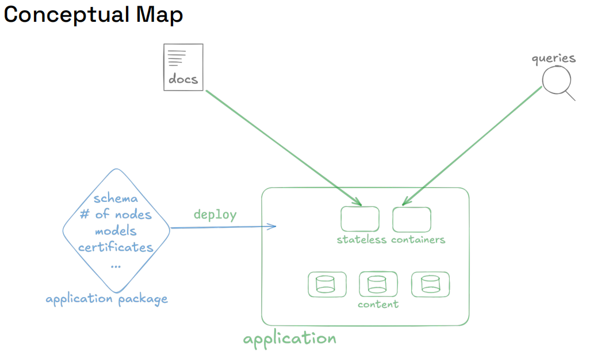
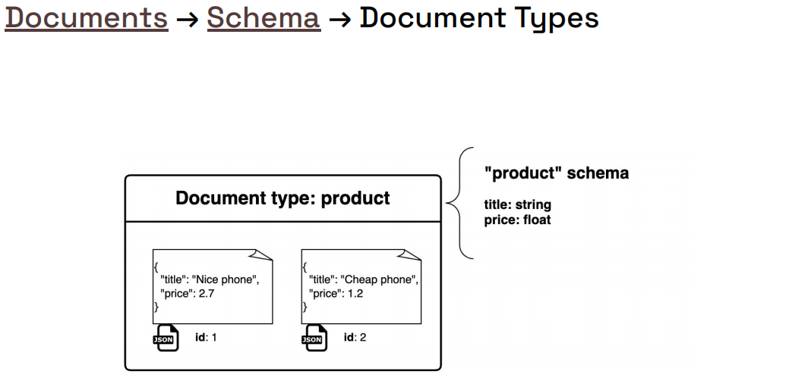
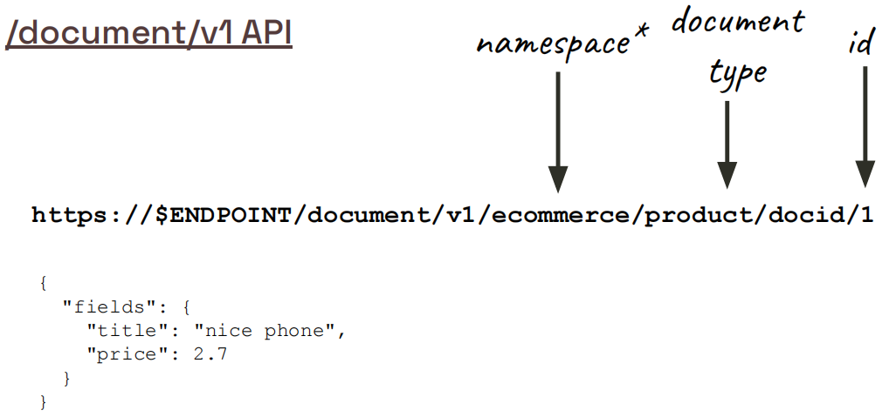
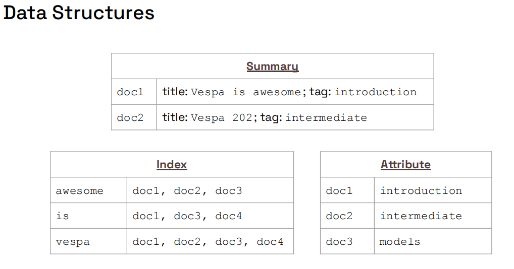
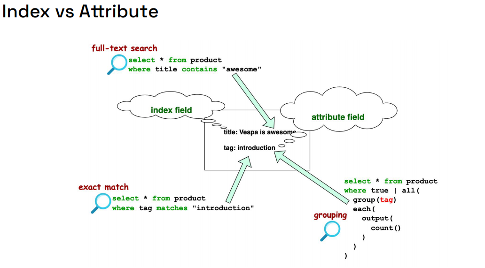
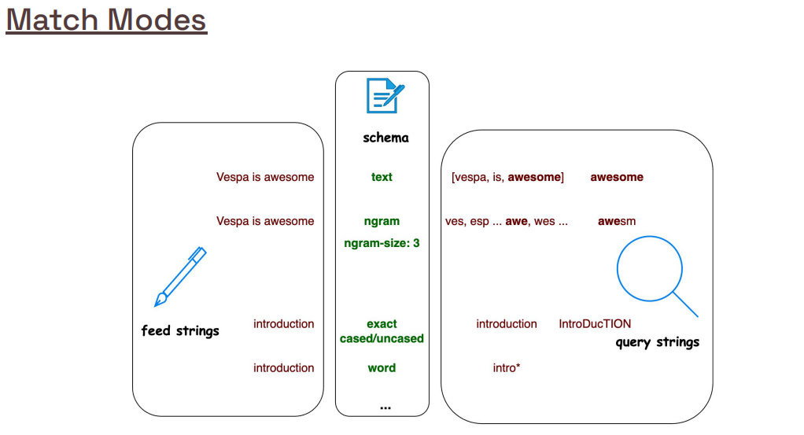
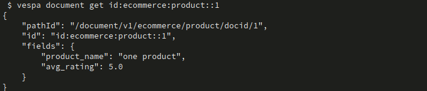
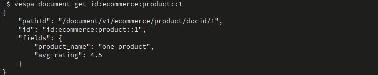

# Simple E-commerce App - Vespa 101 Chapter 1

This is the first tutorial in the **Vespa 101 Fundamentals** course, introducing you to the basics of building a Vespa search application.

## Learning Objectives

By completing this tutorial, you will learn:

- How to define a basic document schema in Vespa
- Understanding simple field types (`string`, `float`)
- Configuring indexing and attribute settings
- Deploying a Vespa application
- Feeding documents to Vespa
- Performing basic queries

---

## Project Structure

```
simple_ecommerce_app/
├── app/
│   ├── schemas/
│   │   └── product.sd                     # Document schema definition
│   ├── security/                          # Security configuration (certs/keys)
│   └── services.xml                       # Vespa service configuration
├── dataset/
│   ├── multiple-products-original.jsonl   # Original sample batch data
│   └── multiple-products.jsonl            # Adjusted batch data for this tutorial
├── img/                                   # Screenshots used in this README
├── sample-product.json                    # Example single document
└── README.md                              # This file
```

---

## Key Concepts

### What is Document Schema?

**Document schema** defines the structure of your data in Vespa. It's like a blueprint that specifies what fields your documents have, their data types, and how they're stored and indexed. You create a schema file (`.sd`) that tells Vespa how to process and search your documents.

**Example**:
- A product schema might define fields like `product_name` (string) and `avg_rating` (float)
- The schema specifies indexing: `index` for searchable fields, `attribute` for filterable fields, `summary` for fields returned in results
- Vespa uses this schema to validate, store, and search your documents

### Simple Field Types

This chapter introduces basic field types:
- **`string`**: Text data (e.g., product names)
- **`float`**: Decimal numbers (e.g., ratings, prices)
- Vespa also supports `int`, `long`, `double`, `bool`, `array<>`, `map<>`, and `tensor<>`, which will be introduced later.

### Indexing and Attribute Configuration

**Indexing modes** control how fields are stored and accessed:
- **`index`**: Full-text indexed for search (enables text search queries)
- **`attribute`**: In-memory storage for fast filtering, sorting, and grouping
- **`summary`**: makes fields available in query results (for display)

### Document API Operations

**Document API** provides CRUD operations for individual documents:
- **PUT**: Create or update a document
- **GET**: Retrieve a document by ID
- **UPDATE**: Modify specific fields of an existing document
- **DELETE**: Remove a document by ID

### Deploying Applications

**Deployment** makes your Vespa application available for use. Use `vespa deploy` to deploy your schema and configuration to Vespa. In Vespa Cloud, deployment also triggers **validation and provisioning**

### Feeding Documents

**Feeding** loads data into Vespa. Use `vespa feed` with JSONL format (one JSON document per line) to batch load documents.

### Basic YQL Queries

**YQL (Vespa Query Language)** is a SQL-like language for querying Vespa. This chapter introduces simple queries for text search and filtering.

---

## Overview

This section introduces the fundamental concepts of Vespa schemas. If you're new to Vespa, we recommend reading the detailed explanations in official docs [SCHEMAS](https://docs.vespa.ai/en/schemas.html) and [SCHEMAS_REF](https://docs.vespa.ai/en/reference/schema-reference.html) for a deeper understanding.

### Conceptual Overview



**What you're seeing:** This diagram illustrates the high-level architecture and workflow of a Vespa application. It shows how the different components of Vespa work together, from defining your schema to deploying your application, feeding documents, and querying your data.

**Key Concepts:**
- **Schema Definition**: The blueprint that defines your document structure, fields, and indexing configuration
- **Application Deployment**: The process of deploying your Vespa application to make it available for use
- **Document Ingestion**: Feeding documents (data) into Vespa using the Document API or feed commands
- **Indexing Pipeline**: How Vespa processes and stores your documents according to the schema configuration
- **Query Processing**: How Vespa handles search queries and returns results based on your schema and indexing setup

**Notes:** Think of it like this workflow:
1. **Define Schema** → Create a `.sd` file that describes your document structure
2. **Deploy Application** → Deploy your schema and configuration to Vespa
3. **Feed Documents** → Load your data (products, in this case) into Vespa
4. **Query Data** → Search and retrieve documents using YQL queries

This conceptual map helps you understand how all the pieces fit together in a Vespa application, from initial setup to querying your data.


### Document Types Overview



**What you're seeing:** This diagram illustrates the hierarchical structure of a Vespa schema. At the top level, you have a **schema** (named `product`), which contains a **document type** (also named `product`). Inside the document, you define **fields** that represent the data you want to store and search.

**Key Concepts:**
- **Schema**: The top-level container that defines your document structure, ranking, and search configuration
- **Document Type**: The blueprint for individual documents (like a table schema in SQL or a collection in MongoDB)
- **Fields**: Individual data attributes (like columns in a database table)

**Notes:** Think of it like this:
- **Schema** = The entire database/application
- **Document Type** = A table/collection (e.g., "products")
- **Fields** = Columns/attributes (e.g., "product_name", "price")

This example of product schema defines a simple document with two fields:

```vespa
schema product {
    document product {
        field product_name type string {
            indexing: summary | index
        }
        
        field avg_rating type float {
            indexing: summary | attribute
        }
    }
}
```


### Field Definitions

- **`product_name`** (string):
  - `summary`: Makes the field retrievable in query results (you can display it to users)
  - `index`: Field is indexed for full-text search (you can search within this field)
  
- **`avg_rating`** (float):
  - `summary`: Makes the field retrievable in query results (you can display it to users)
  - `attribute`: Field is stored in-memory for fast filtering, sorting, and grouping (you can filter by rating, sort by rating, etc.)


### Document API Overview



**What you're seeing:** This diagram shows how to interact with documents in Vespa using the **Document API v1**. The Document API is how you create, read, update, and delete individual documents in Vespa.

**Key Concepts:**
- **PUT**: Create or update a document (if document ID exists, it updates; otherwise, it creates)
- **GET**: Retrieve a document by its ID
- **UPDATE**: Modify specific fields of an existing document
- **DELETE**: Remove a document by its ID

**Notes:** The Document API is like CRUD operations in a database:
- **PUT** = INSERT or UPDATE (upsert)
- **GET** = SELECT by ID
- **UPDATE** = UPDATE specific fields
- **DELETE** = DELETE by ID

**Document ID Format:** Documents are accessed via URLs like:
```
/document/v1/<namespace>/<document-type>/<document-id>
```

For example:
```
/document/v1/default/product/doc:product:12345
```

**Learn More:**
- Official Docs: [Document API Guide](https://docs.vespa.ai/en/writing/document-v1-api-guide.html)
- Official Docs: [Document API Reference](https://docs.vespa.ai/en/reference/api/document-v1.html)
  

### Data Structure Overview



**What you're seeing:** This diagram illustrates the complete data flow and structure in Vespa which are Summary, Attribute, and Search Index. From how documents are stored to how they're retrieved and searched.

**Key Concepts:**
- **Document**: The actual data you store (JSON format)
- **Schema Definition**: The blueprint that defines document structure
- **Indexing Pipeline**: How Vespa processes and stores your data
- **Summary**: Logical layer Vespa uses to retrieve fields marked as `summary`
- **Attribute**: In-memory data structures used for filtering, sorting and grouping
- **Search Index**: Where searchable data is stored

**Notes:** When you feed a document to Vespa:
1. Vespa reads your **schema definition** to understand the structure
2. It processes each field according to its **indexing directives**:
   - Fields with `summary` → are included in summary classes (for retrieval)
   - Fields with `attribute` → stored in memory as attributes (for filtering/sorting)
   - Fields with `index` → stored in **search index** (for full-text search)
3. When you query, Vespa uses these stores to find and return results


### Index and Attribute Overview



**What you're seeing:** This diagram explains the critical difference between `index` and `attribute` indexing directives - one of the most important concepts for Vespa beginners!

**Key Differences:**

| Feature | `index` | `attribute` |
|---------|---------|-------------|
| **Primary Use** | Full-text search | Filtering, sorting, grouping |
| **Storage** | Search index (disk-backed with memory structures / OS cache) | In-memory column store |
| **Speed** | Fast for text search | Very fast for exact matches |
| **Memory** | Lower memory usage | Higher memory usage |
| **Use Cases** | Search within text fields | Filter by price, sort by rating, group by category |

**Notes:**
- **Use `index`** when you want to **search within** a field (e.g., search for "laptop" in product descriptions)
- **Use `attribute`** when you want to **filter, sort, or group** by a field (e.g., filter products where price < 100, sort by rating)

**Common Combinations:**
```vespa
// Searchable text field
field title type string {
    indexing: summary | index
}

// Filterable/sortable field
field price type float {
    indexing: summary | attribute
    attribute: fast-search
}

// Both searchable AND filterable
field category type string {
    indexing: summary | index | attribute
}
```

**Learn More:**

- Official Docs: [Indexing](https://docs.vespa.ai/en/indexing.html)

### Match Modes Overview



**What you're seeing:** This diagram shows different **match modes** - how Vespa matches query terms against indexed text fields. Match modes control the precision and flexibility of text matching.

**Key Match Modes:**

1. **Exact Match**: Matches exact tokens without linguistic processing
   - Query: `"laptop computer"` → Only matches documents with exactly "laptop computer"
   - Use when: You need precise tokens matching

2. **Word Match**: Matches individual words (most common)
   - Query: `laptop computer` → Matches documents containing both "laptop" AND "computer"
   - Use when: You want flexible word-based search (default for most cases)

3. **Prefix Match**: Matches words starting with the query
   - Query: `lap` → Matches "laptop", "laptop bag", "laptop case"
   - Use when: You want autocomplete or prefix search

4. **Substring Match**: Matches any part of the text
   - Query: `top` → Matches "laptop", "desktop", "top-rated"
   - Use when: You need flexible matching (slower, use sparingly at scale)

**Notes:** Match modes are like different search behaviors:
- **Exact** = Google search with quotes: `"exact phrase"`
- **Word** = Normal Google search: `laptop computer` (finds both words)
- **Prefix** = Autocomplete: typing `lap` shows "laptop" suggestions
- **Substring** = Finding text anywhere: `top` finds "laptop" and "desktop"

**Configuration Example:**
```vespa
field product_name type string {
    indexing: summary | index
    match: word  // Default: word, but can also use: exact, prefix, substring
}
```

**Learn More:**
- Official Docs: [Matching](https://docs.vespa.ai/en/reference/schemas/schemas.html#match)

## LAB Prerequisites (add basic query)

Before starting, ensure you have:

1. **Vespa CLI installed**:
   ```bash
   # macOS
   brew install vespa-cli
   
   # Or Linux, MacOS, Windows
   # Download binary from GitHub releases
   # Visit: https://github.com/vespa-engine/vespa/releases
   # Place the extracted binary in an executable path directory so it can be called from anywhere
   
   # Verify installation
   vespa version
   ```

   **More detail:** https://docs.vespa.ai/en/clients/vespa-cli.html

2. **Vespa Cloud account**:
   - Sign up at https://cloud.vespa.ai/
   - Free tier available at https://vespa.ai/free-trial/
  
3. **Clone this repository**:
   ```
   git clone https://github.com/vespauniversity/vespaworkshop101/
   ```

## Step 1 – Setup and Configuration

### Vespa Cloud

1. **Configure Vespa CLI for cloud**:
   ```bash
   # set the application target
   vespa config set target cloud

   # set application name 
   # $ vespa config set application <tenant>.<application>
   # or with instance name (by default the instance name is default)
   # $ vespa config set application <tenant>.<application>.<instance>

   # set the application name something like:
   vespa config set application my-tenant.simple-ecommerce-app
   ```
**Notes**: on Vespa Cloud naming rules:
- Must start with a letter
- Max 40 characters
- Only lowercase letters, digits, or dashes
- No double-dashes

2. **Authenticate**:
   ```bash
   cd simple-ecommerce-app/app
   vespa auth login
   vespa auth cert
   # generate/copy the cert from .vespa dirs to this application if needed
   # vespa auth cert add -f
   ```

3. **Verify configuration**:
   ```bash
   vespa config get target        # Should show: cloud
   vespa config get application   # Should show: tenant.app.instance
   vespa auth show                # Should show: Success
   ```

## Step 2 – Deploy the Application

1. **Make sure that you are in the application directory**:
   ```bash
   cd simple-ecommerce-app/app
   ```

2. **Deploy the application**:
   ```bash
   vespa deploy --wait 300
   ```


3. **Check deployment status**:
   ```bash
   vespa status
   ```


The deployment should show the application is ready. This creates:
- A container cluster for handling queries and document operations
- A content cluster for storing and indexing documents
- Run a test query below. For now, you will get no documents because we haven't indexed any.
  ```
  vespa query -v 'yql=select * from sources * where true'
  ```

## Step 3 – Feed Data to Vespa

### Feed a Single Document

Use the sample product document:

```bash
vespa document put id:ecommerce:product::1 ../sample-product.json
```

The document structure:
```json
{
  "id": "id:ecommerce:product::1",
  "fields": {
    "product_name": "one product",
    "avg_rating": 5.0
  }
}
```


### Feed Multiple Documents

Feed the batch file with multiple products:

```bash
vespa feed ../dataset/multiple-products.jsonl
```

The JSONL file contains documents in the format:
```json
{"put": "id:ecommerce:product::1", "fields": {"product_name": "phone", "avg_rating": 2.0}}
{"put": "id:ecommerce:product::2", "fields": {"product_name": "pen", "avg_rating": 4.2}}
{"put": "id:ecommerce:product::3", "fields": {"product_name": "new laptop", "avg_rating": 3.5}}
```


### Verify Documents Are Indexed

Check that documents were successfully indexed:

```bash
vespa query 'yql=select * from product where true'
```

This query returns all documents in the product schema.


## Step 4 – Document Operations

### Get Specific Document

Retrieve a document by ID:

```bash
vespa document get id:ecommerce:product::1
```



### Update a Document

Update an existing document:

```bash
vespa document update id:ecommerce:product::1 -d '{
  "fields": {
    "avg_rating": { "assign": 4.5 }
  }
 }'
```


Check the updated document:

```bash
vespa document get id:ecommerce:product::1
```



### Delete a Document

Remove a document:

```bash
vespa document remove id:ecommerce:product::1
```


Check the removed document:

```bash
vespa document get id:ecommerce:product::1
```


Rerun feed to restore the document

```bash
vespa feed ../dataset/multiple-products.jsonl
```

## Step 5 – Querying Data

### Basic Text Search

Search for products by name:

```bash
vespa query 'yql=select * from product where product_name contains "phone"'
```


### Filter by Rating

Filter products with a specific rating:

```bash
vespa query 'yql=select * from product where avg_rating > 3.0'
```


### Combined Search and Filter

Combine text search with filtering:

```bash
vespa query 'yql=select * from product where product_name contains "laptop" and avg_rating >= 3.5'
```


## Understanding Indexing Modes

### `index` (for `product_name`)
- Enables full-text search
- Allows queries like `product_name contains "phone"`
- Uses inverted index for fast text matching

### `attribute` (for `avg_rating`)
- Stored in-memory for fast access
- Enables filtering: `avg_rating > 3.0`
- Enables sorting: `order by avg_rating`
- Enables grouping/aggregation operations

### `summary`
- Both fields have `summary` enabled
- Fields are returned in search results
- Required to see field values in query responses

## Exercise – Practice Basic Queries and Operations

Here are practice tasks to reinforce what you've learned. Try these exercises using the Vespa CLI:

### 1. Basic Text Search Variations

Practice different text search queries:

- **Search for products containing "laptop"**  
  ```bash
  vespa query 'yql=select * from product where product_name contains "laptop"'
  ```

- **Search for products containing "phone"**  
  ```bash
  vespa query 'yql=select * from product where product_name contains "phone"'
  ```

- **Search for products containing multiple words**  
  ```bash
  vespa query 'yql=select * from product where product_name contains "new"'
  ```

### 2. Filtering by Rating

Practice filtering queries using the `avg_rating` field:

- **Find products with rating greater than 3.0**  
  ```bash
  vespa query 'yql=select * from product where avg_rating > 3.0'
  ```

- **Find products with rating exactly 4.5**  
  ```bash
  vespa query 'yql=select * from product where avg_rating = 4.5'
  ```

- **Find products with rating between 3.0 and 4.5**  
  ```bash
  vespa query 'yql=select * from product where avg_rating >= 3.0 and avg_rating <= 4.5'
  ```

### 3. Combined Search and Filter

Combine text search with rating filters:

- **Find laptops with rating above 3.5**  
  ```bash
  vespa query 'yql=select * from product where product_name contains "laptop" and avg_rating >= 3.5'
  ```

- **Find phones with rating below 3.0**  
  ```bash
  vespa query 'yql=select * from product where product_name contains "phone" and avg_rating < 3.0'
  ```

### 4. Limit Results

Practice limiting the number of results returned:

- **Get only the first 2 products**  
  ```bash
  vespa query 'yql=select * from product where true limit 2'
  ```

- **Get top 3 products with high ratings**  
  ```bash
  vespa query 'yql=select * from product where avg_rating >= 4.0 limit 3'
  ```

### 5. Select Specific Fields

Practice returning only specific fields instead of all fields:

- **Return only product names**  
  ```bash
  vespa query 'yql=select product_name from product where true'
  ```

- **Return product names and ratings**  
  ```bash
  vespa query 'yql=select product_name, avg_rating from product where true'
  ```

### 6. Document Operations Practice

Practice CRUD operations:

- **Create a new product**  
  ```bash
  vespa document put id:ecommerce:product::10 -d '{
    "fields": {
      "product_name": "wireless mouse",
      "avg_rating": 4.8
    }
  }'
  ```

- **Update the rating of an existing product**  
  ```bash
  vespa document update id:ecommerce:product::10 -d '{
    "fields": {
      "avg_rating": { "assign": 4.9 }
    }
  }'
  ```

- **Retrieve the updated product**  
  ```bash
  vespa document get id:ecommerce:product::10
  ```

- **Delete the product**  
  ```bash
  vespa document remove id:ecommerce:product::10
  ```

### 7. Understanding Index vs Attribute

Observe the difference between `index` and `attribute`:

- **Try searching on `avg_rating` (attribute field)**  
  ```bash
  # This will fail - attributes are not searchable with "contains"
  vespa query 'yql=select * from product where avg_rating contains "4"'
  ```
  Notice: Attribute fields use exact matching (`=`, `>`, `<`), not text search (`contains`).

- **Try filtering on `product_name` (index field)**  
  ```bash
  # This works - index fields support "contains" for text search
  vespa query 'yql=select * from product where product_name contains "phone"'
  ```

**Key Takeaway**: 
- Fields with `index` → Use `contains` for text search
- Fields with `attribute` → Use `=`, `>`, `<`, `>=`, `<=` for exact matching and filtering

---

## Destroy The Deployment

**Note:** Destroy the application if needed:
   ```bash
   vespa destroy
   ```

## Troubleshooting

### Application Not Ready
- Wait for deployment: `vespa status --wait 300`
- Check logs: `vespa log` (for cloud)


### Feed Failed
- Verify schema matches document structure
- Check document ID format: `id:<namespace>:<document-type>::<id>`
- Ensure application is deployed: `vespa status`

### No Results Returned
- Verify data is fed: `vespa query 'yql=select * from product where true'`
- Check query syntax
- Enable tracing: `vespa query 'yql=...' 'traceLevel=5'`

## Next Steps

After completing this tutorial, proceed to:

- [**Chapter 2**](https://github.com/vespauniversity/vespaworkshop101/tree/main/ecommerce_app): Full E-commerce Application - Learn about complex schemas, CRUD operations, and data ingestion
- [**Chapter 3**](https://github.com/vespauniversity/vespaworkshop101/tree/main/semantic_ecommerce_app): Semantic Search - Add vector embeddings for semantic similarity search
- [**Chapter 4**](https://github.com/vespauniversity/vespaworkshop101/tree/main/hybrid_ecommerce_app): Hybrid Search - Combine text and semantic search
- [**Chapter 5**](https://github.com/vespauniversity/vespaworkshop101/tree/main/sales_data_app): Sales Data Analytics - Work with time-series data and aggregations

## Additional Resources

- [Vespa Documentation](https://docs.vespa.ai/)
- [Schema Reference](https://docs.vespa.ai/en/schemas.html)
- [Query API Reference](https://docs.vespa.ai/en/query-api.html)
- [Document API Guide](https://docs.vespa.ai/en/document-v1-api-guide.html)
- [Vespa Cloud](https://cloud.vespa.ai/)

**Key takeaway**: This chapter gives you the basic building blocks of a Vespa application – simple schema design, indexing modes, feeding, and querying.

Proceed to [Chapter 2](https://github.com/vespauniversity/vespaworkshop101/tree/main/ecommerce_app)

